## 前言
	- ### 資料來源
- # 目錄
	- ((26b61e51-7681-4f4d-84ba-b7052fca2833))
	- ((66a728b4-e6b9-465c-bca9-d9c5f1e2db55))
	- ((66a74771-321a-4f63-98d3-35275549db9f))
	- ((66a83b3f-4bb3-4aeb-bb43-ec7cf4c38ec6))
	- ((66a845cd-21c0-4365-9f50-2e3adc6310fd))
	- ((66a87548-8a3f-4536-ab43-430462c9bc14))
	- ((66a8910f-e6df-4b6b-8697-0cd0a38a09d6))
	- ((66aad81a-7cf3-4f98-ba6c-6ea52a5bd587))
- # The Journey of Becoming a Vulnerability Researcher
  id:: 26b61e51-7681-4f4d-84ba-b7052fca2833
  collapsed:: true
	- ## Bug hunting
		- 可能的危害
			- RCE
			- Privilege Escape
				- Root/Jail Brak
				- Sandbox Escape
			- Information Disclosure
				- memory address leak
			- Dos
				- BSOD
					- Windows 全球大當機
		- 漏洞分析員
			- 如何成為
				- How to start
					- 一定程度的計算機科學知識
					- 書
						- 程式設計師的自我修養
						- The Art of Software Security Assessment
						- Binary HACK
					- Learning from CTF
						- 例子
							- Octf 2019 babyaegis
								- addressSanitizer
							- Octf 2020 ChromiumRCE
						- 如何挑選CTF
							- 初學
								- 教育型的
								- wargame
									- pwnable.xyz
							- 基本
								- Plaid CTF
								- Google CTF
								- HITCON CTF
								- Balsn CTF
							- 從CTFtime看CTF分數選要比的
						- 解不出來怎麼辦
							- Don't give up
							- 觀看別人的writeup
							- 多多練習找洞的方式
						- 解出來之後就沒事了嗎?
							- 觀看別人的解法，練習漏洞利用的思路
						- 紀錄
							- 多寫writeup
							- 寫下學習到的技術
						- 一定程度後要挑戰real world
							- 35c3 shallow water
					- 其他學習管道
						- 外掛程式
						- 破解軟體
						- 實際漏洞分析
				- PLAY IN REAL WORLD
					- 與CTF差異
						- 時間較短，在有限時間
						- 已知漏洞
						- 一定有解
						- 不用管穩定度
					- Exploit 穩定度非常重要，必須理解細節
					- 從何做起
						- 多看別人的分析文章
						- 從Patch到別人的利用過程
							- Pwn2Own imageCLASS
							- Analysis VirtualBox
						- 學習diff的技巧，很多漏洞是基於過往漏洞修補的繞過
						- 挑自己感興趣的CVE學習
				- Bug hunting from real world
					- 挑選有興趣的目標
						- 印表機、router
					- 階段
						- Junior Bug hunter
							- 從小型專案、軟體
								- 報稅軟體、IOT設備
							- Router
								- TP-Link Router Hacked
						- Bug hunter
							- 從中小型open source專案
							- 單一功能的服務或軟體
							- 掌握自己未來的領域
							- Pwn2Own Mobile
						- Senior Bug hunter
							- 挑一些大型專案
								- Linux kernel
								- office
								- Browser
								- 挑戰Pwn2Own
							- 挑一些自己能力高一點點的目標
							- 專精於一個目標
					- 漏洞挖掘階段
						- Recon
							- 環境建置
								- 視情況建立可debug環境
								- 先評估會不會花太多時間
							- 運作原理分析
								- 閱讀相關文章
							- 架構分析
								- 有哪些元件，那些功能，如何傳遞資料
								- 如何互動
							- 攻擊面分析
								- 哪些服務是碰得到的
								- 那些功能是pre-auth
								- 有沒有其他第三方open source project
							- 歷史漏洞分析
								- coding style差，漏洞可能就較多
								- 定期追蹤patch
								- 過去研究，各大conference
							- 全新攻擊面
							- 其他管道
								- twitter
						- Analysis
							- fuzzing
								- AFL
									- 可配合ASAN
							- Code Audit & reverse
							- 工具
								- CodeQL
								- Vim + gtags
								- IDA Plugin
									- Abyss
									- LazyIDA
								- GDB Plugin
									- pwngdb
									- gef
								- Process Monitor
								- Trace系列
									- Ltrace/Strace
									- Dtrace
							- Entry point
								- 不要都從main開始分析
								- 從dangerous function往回找
								- 從功能面找
								- 從user input往下追
							- bug hunting
								- 不要假設他有好好寫
							- 擴大攻擊面
								- 需要使用者互動->不需要使用者互動
			- 讀書會
				- Deep hacking
- # 威脅情資&機器學習
  id:: 66a728b4-e6b9-465c-bca9-d9c5f1e2db55
  collapsed:: true
	- what is Threat Intelligence
		- 知己知彼，百戰不怠
	- 威脅情資工具
		- DDOS map
		- shodan
	- APT (advanced persistent threat，高級長期威脅)
	- 情資分類
		- 威脅情資
		- 暗網情資
		- 曝險情資
		- 場域資產
	- 如何使用情資
		- 威脅偵測
		- 攻擊歸因
		- 企業曝險
		- 資產盤點
	- 痛苦金字塔
		- 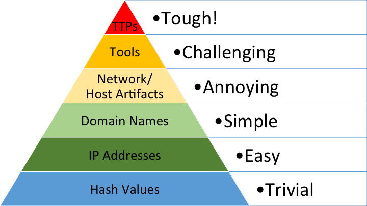
			- https://0x666.club/pyramidofpain1/
	- TTP
		- Tactics, Techniques, and Procedures (戰術、技巧和程序)
		- https://0x666.club/pyramidofpain1/
	- STIX 架構
		- 
			- https://stixproject.github.io/about/
	- 企業曝險
		- 暗網
		- MagBo
			- web shell
	- 威脅組織歸因
		- the diamond model
			- 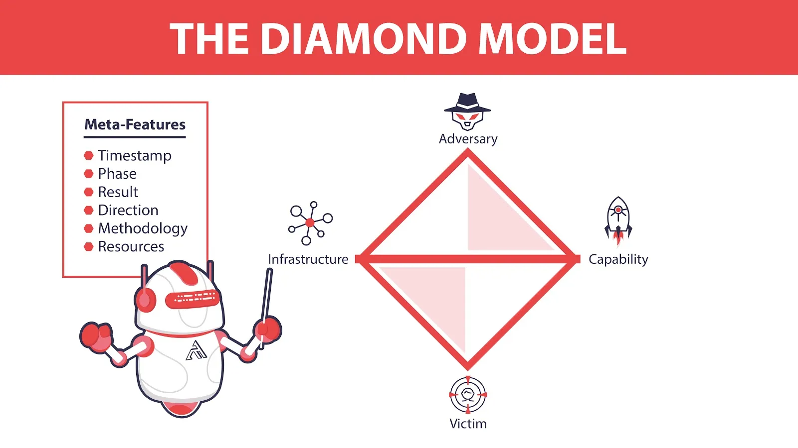
				- https://medium.com/cycraft/cycraft-classroom-mitre-att-ck-vs-cyber-kill-chain-vs-diamond-model-1cc8fa49a20f
	- 惡意程式分類
		- 機器學習在資安的最經典應用
		- 多種不同分法
			- 惡意/正常
			- 家族
			- 種類
			- (正常程式也算一類)
		- 機器學習
			- 惡意程式與正常程式比例
				- 1:1 (magic number)
		- 資料集
			- 量級: 10000 (magic number)
			- 種類
				- 訓練資料集 (課本知識)
				- 驗證資料集 (考古題)
				- 測試資料集 (正式考試)
					- 實際運用的資料集
					- 可以是沒有標記的
		- 模型目標要盡量降低訓練資料集的損失 (Loss)
		- overfitting
			- 結果與訓練資料集正確率過高，可能導致未知資料的結果與實際結果差距過大
		- 驗證資料及如何產生
			- 問題: 有可能剛好都切到某個類別，像都切到惡意程式
			- 解決方案: k-folds
		- 資料分布
			- 資料內容在空間中的分佈
		- 評量指標
			- 不只有準確度
		- 系統架構
			- 特徵形式
			- 模型選擇
		- 模型類別
			- 傳統機器學習方式
			- 深度學習方式
		- 資料前處理
			- 靜態特徵
			- 動態特徵
		- 正規化
		- 標準化
			- 常態分布
		- NLP
			- NER
				- 取得的惡意程式幾乎都是非結構化的
- # 面對國家級關鍵基礎設施網路攻擊威脅: 從工業控制系統到網路攻防
  id:: 66a74771-321a-4f63-98d3-35275549db9f
  collapsed:: true
	- 關鍵基礎設施 (CI)
		- 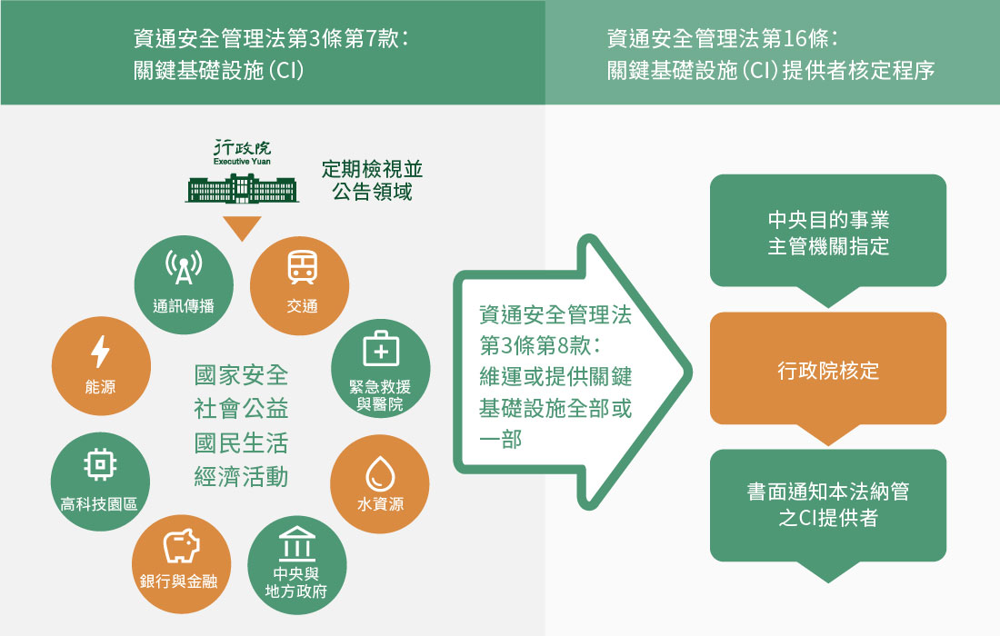
			- https://moda.gov.tw/ACS/operations/ciip/650
	- 工業控制系統 (ICS)
		- 營運技術 (OT)
		- 普渡模型
			- 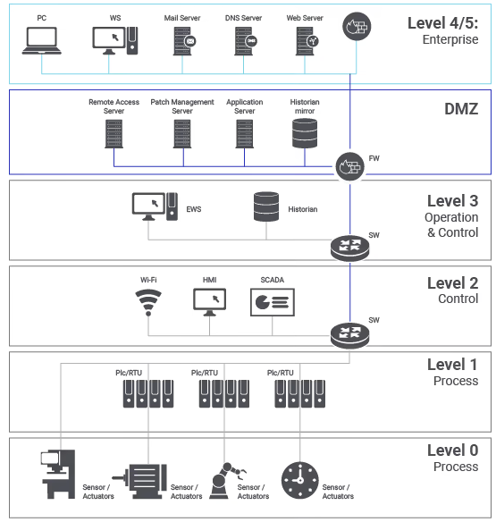
				- https://hackmd.io/@tuBp9oxkSra7nw4TNItvUg/Syln1qLbo
		- PLC 邏輯控制
			- 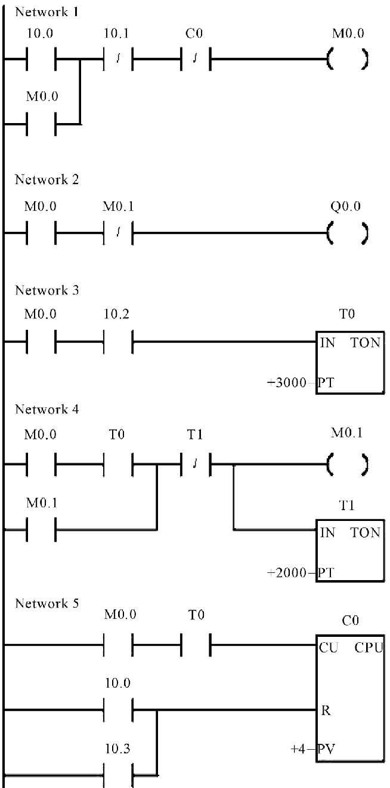
				- https://www.researchgate.net/figure/The-PLC-ladder-diagram_fig3_272666766
			- XOR
				- 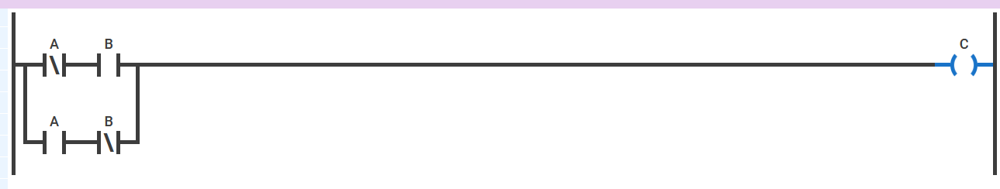
	- Safety 不等於 Security
		- 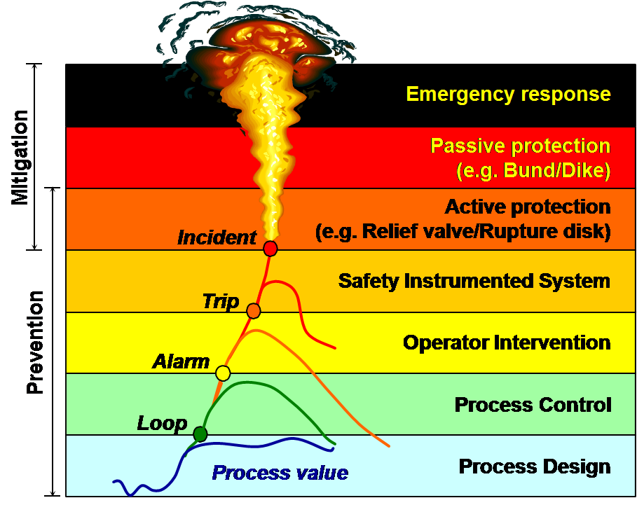
			- https://www.arcweb.com/blog/where-alarm-management-process-safety-intersect
	- ICS 攻擊面
		- 伺服器攻擊
			- 多為windows系統
			- 設備老舊
		- 通訊協議攻擊
			- 工控通訊協議
				- modbus
				- S7Comm
				- MQTT
					- IT和OT常見接口
					- 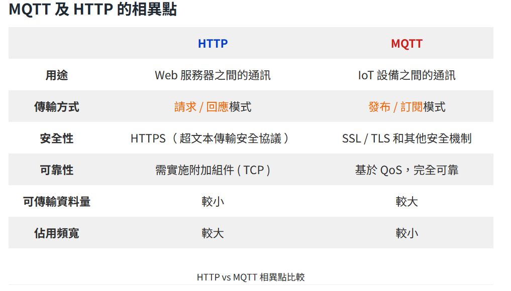
						- https://resource.webduino.io/blog/mqtt-guide
			- 越來越多工控通訊協議開始使用乙太網路為基礎
			- 可以偽造封包
		- 無線網路攻擊
			- 無線射頻
				- https://zh.wikipedia.org/zh-tw/%E5%B0%84%E9%A2%91%E8%AF%86%E5%88%AB
			- 常見工具
				- Wifi
				- Bluetooth
				- Zigbee
			- 攻擊步驟
				- 取得頻率
					- FCC id
				- 調變
					- https://www.sigidwiki.com/wiki/Signal_Identification_Guide
				- 取得wireless數據
			- 工具
				- rfcat
		- 實體攻擊
			- Debug interface
			- Elethcat
			- 例子
				- UART
					- CVE-2018-9149
		- 供應鏈攻擊
			- PLC life cycle
				- 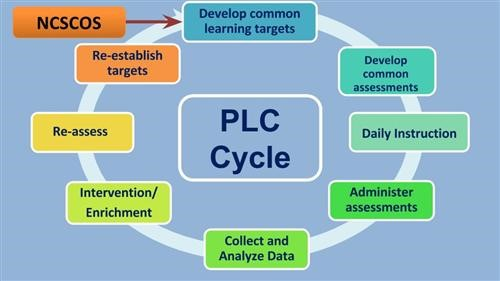
					- http://lmlionleaders.blogspot.com/2015/08/the-power-of-plc.html
	- ICS 防護策略
		- 威脅情資
			- MITRE ATT&CK (實戰型的威脅情資)
				- 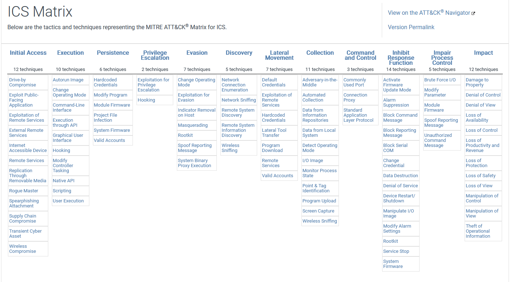
				- https://attack.mitre.org/matrices/ics/
		- SBOM
			- 供應鏈管理的重要步驟
			- https://www.cisa.gov/sbom
			  id:: 66a760ca-2f56-4810-844c-1421566709c7
			- 最少組成元件
				- 文件資訊
				- 元件資訊
		- VEX
			- https://cyclonedx.org/capabilities/vex/
		- 軟體標示符
			- 固定標示符
			- 定義標示符
- # 資安倫理
  id:: 66a83b3f-4bb3-4aeb-bb43-ec7cf4c38ec6
  collapsed:: true
	- 基本法律觀念
		- 前科
			- 判決有罪確定，執行之紀錄
			- 不予紀錄:緩刑、易科罰金者
			- 無法取得良民證
		- 刑法第36章 妨礙電腦使用罪
			- 告訴乃論 -> 363
				- 駭入他人電腦 -> 358
				- 取得、修改等 -> 359
				- 干擾他人電腦 -> 360
			- 攻擊公務機關 -> 361
		- 個人資料保護法
			- 特種個資
				- （一）病歷
				- （二）醫療
				- （三）基因
				- （四）性生活
				- （五）健康檢
				- （六）犯罪前科
			- 著作權
				- 著作權 vs 智慧財產權
					- 著作權無需申請、告訴乃論
				- 專利
					- 發明 -> 20年
					- 新型 -> 12年
					- 新式樣 -> 12年
				- 著作財產權
				- 著作人格權
				- 開源協議
					- 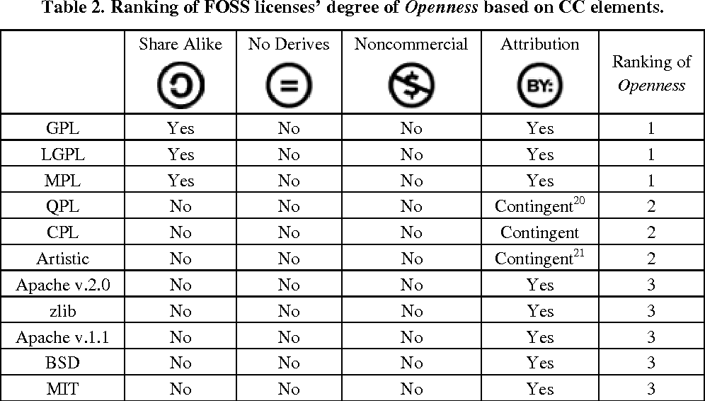
					- GPL不能商業化
- # IDA 不只有 F5 可以按、IDA 101, Reverse 101
  id:: 66a845cd-21c0-4365-9f50-2e3adc6310fd
  collapsed:: true
	- 
- # IoT 檢測實務
  id:: 66a87548-8a3f-4536-ab43-430462c9bc14
  collapsed:: true
	- 
	- IOT 設備產業生態系
		- OEM
	- OWASP IOT Top 10
		- I1 Weak, Guessable, or Hardcoded Passwords
		- I2 Insecure Network Services
		- I3 Insecure Ecosystem Interfaces
		- I4 Lack of Secure Update Mechanism
		- I5 Use of Insecure or Outdated Components
		- I6 Insufficient Privacy Protection
		- I7 Insecure Data Transfer and Storage
		- I8 Lack of Device Management
		- I9 Insecure Default Settings
		- I10 Lack of Physical Hardening
	- 常見鮑率
		- https://lucidar.me/en/serialib/most-used-baud-rates-table/
	- 常見boot
		- uboot
	- openWARP
		- https://nrel.github.io/OpenWARP/
	-
- # 金融科技資安思維與關鍵
  id:: 66a8910f-e6df-4b6b-8697-0cd0a38a09d6
  collapsed:: true
	- 金融科技範疇
		- 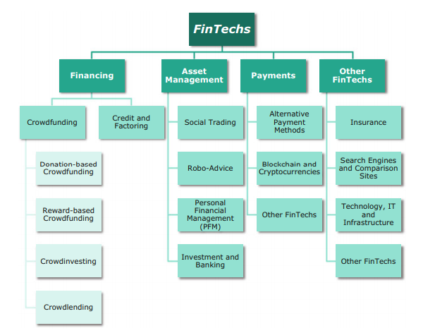
			- https://zh.wikipedia.org/zh-tw/%E9%87%91%E8%9E%8D%E7%A7%91%E6%8A%80
		- Customer Engagement
		- Law & Regulations
		- Information Security
		- IOT
		- Wealth Management
		- Data Analytics
	- 資安生態系5大要件
		- 資料
		- 人
		- 程序
		- 硬體
		- 軟體
	- 人與程序是最常被忽視的資安問題
		- 人需要有資安意識
		- 程序需要遵循資安規範與政策
	- 監理科技
	- CMMC 美國軍工產業供應鏈認證
	- 半導體供應鏈規範
		- SEMI E187/188
	- 台灣通用資安人才類別
		- 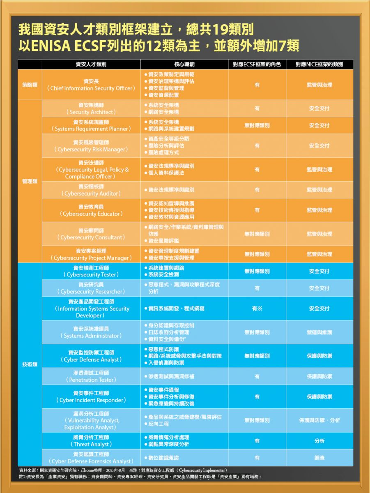
	- 瑞士奶酪理論
		- https://zh.wikipedia.org/zh-tw/%E7%91%9E%E5%A3%AB%E5%A5%B6%E9%85%AA%E7%90%86%E8%AE%BA
		- 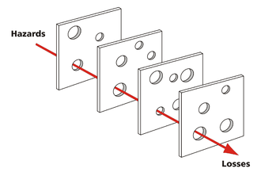
	- 資安防護矩陣 CDM
		- 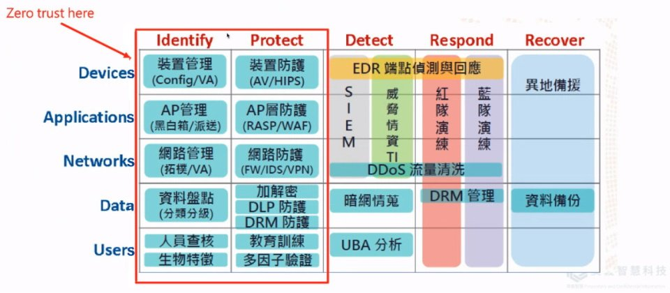
			- 
	-
- # 深入淺出網域(AD)安全:細探各項AD組態設定的濫用
  collapsed:: true
	- Active Directory (AD)
		- Directory Service
	- Domain Controller (DC)
	- Object
	- Attribute
	- Forest (微軟預設的安全邊界)
	- LDAP
		- DN(Distinguished Name)
		- RDN(Relative Distinguished Name)
		- CN(Common Name)
		- OU(Organizational Unit Name)
		- O (Organizational Unit )
		- DC(Domain Component)
		- LDAP://DC=test,DC=voww,DC=com,OU=RD Dept,CN=Mars
	- Security Identifier (SID)
		- uniquely identify a security principal / security group
		- 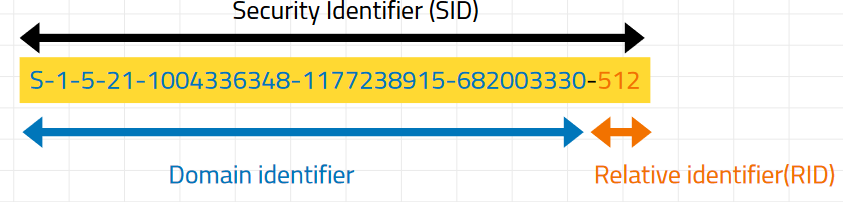
	- AD DS database (NTDS.DIT)
	- GPO
		- 為了在多位使用者或機器下的政策設置
	- impacket
- # 初探威脅情資的奧秘
  collapsed:: true
	- 
	- 
	- virustotal
		- https://www.virustotal.com/
	- Malware Analysis
		- Observation
		- Dynamic Analysis
		- Static Analysis
	- winAPI
		- VirtualAlloc
		- VirtualProtect
		- WriteProcessMemory
		- LoadLibrary
		- Get_process
- # API 安全
  id:: 66aad81a-7cf3-4f98-ba6c-6ea52a5bd587
  collapsed:: true
	- RESTful API
	- GraphQL
		- 利用Query語法一次傳送請求
	- grpc
		- 利用binary encode減少封包體積
		- 透過HTTP2等底層協議加速傳輸速率
	- microservice
		- 模組化服務，簡化每個服務的複雜度
	- 身分驗證
		- Session-based
			- Token-based
				- Pre-shared token
				- JWT Token
			- Client-based LST
	- OWASP API Top 10
		- Broken Object Level Authorization
	- GraphQL DOS
- # Cloud security
  collapsed:: true
	-