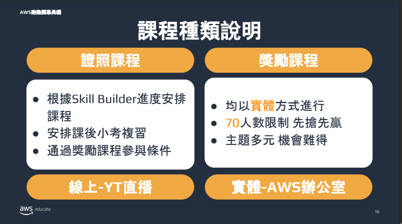
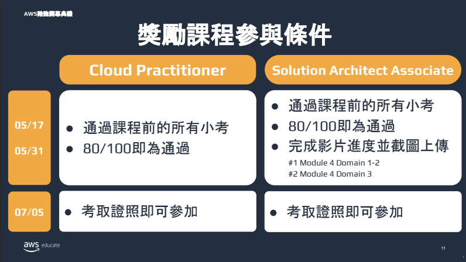
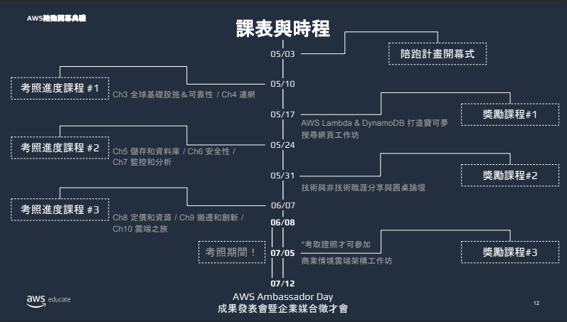
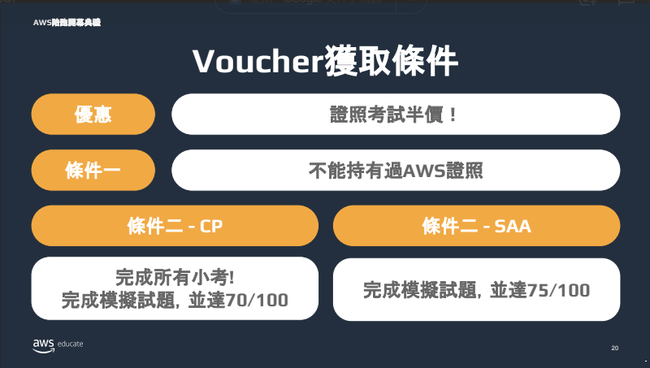

public:: true

- ## 前言
- # 目錄
	- ((6620d1f5-a6f5-424e-8df5-c252b83736b3))
	- ((663641b4-30e8-4671-b751-8ff7423b1147))
- # AWS Cloud Practitioner Essentials
  id:: 6620d1f5-a6f5-424e-8df5-c252b83736b3
  collapsed:: true
	- ### 用戶端-伺服器模型
		- ### AWS的Amazon Elastic Computer Cloud (Amazon EC2)及為一種虛擬伺服器
	- ### 企業選擇雲端策略之考量因素：
		- ### 必備雲端應用程式元件
		- ### 偏好的資源管理工具
		- ### 任何舊版IT基礎設施需求
	- ### 雲端運算部署模型
		- ### 雲端
			- ### 可部署現有應用或為雲端設計新的應用程式
			- ### 可於低層級基礎設施中部暑此類應用，但需由IT人員加以管理
			- ### 或使用較高層級的服務，以減少核心基礎設施的管理、架構和擴充需求
		- ### 內部部暑
			- ### 也稱為私有雲端部暑
			- ### 透過虛擬化和資源管理工具將資源部暑於內部部署
		- ### 混合
			- ### 此模型中，雲端資料會連接到內部部暑基礎設施
			- ### 可整合雲端資源與傳統IT應用
	- ### 雲端運算的優勢
		- ### 將預付成本轉換成變動成本
		- ### 停止將資金花費在執行和維護資料中心上
		- ### 無須猜測容量
		- ### 受易於大範圍規模經濟
		- ### 提升速度與敏捷性
		- ### 快速進入市場
	- Amazon Elastic Compute Cloud (Amazon EC2)
		- 垂直擴展
			- 能夠為EC2執行個體調整資源大小
		- 運算及服務（Caas）模型
		- 執行個體類型
			- 一般用途
			- 運算最佳化
			- 記憶體最佳化
			- 加速運算
			- 儲存最佳化
			-
- # AWS 考照
  id:: 663641b4-30e8-4671-b751-8ff7423b1147
  collapsed:: true
	- ### 連結
		- [Notion](https://aws-educate-tw.notion.site/AWS-0824fda6e4aa470e863c4d91daf9563a)
		- [Skill Bulider](https://explore.skillbuilder.aws/)
		  id:: 6636464a-894d-4a13-8d59-73a55e651816
	- ### 簡介
	  collapsed:: true
		- ### 課程模式
			- 
			- 
		- ### 時程
			- {:height 399, :width 688}
		- ### 得到考證半價方式
			- 
			- 數量不確定所以越早做完試題月有機會得到
			- 以取得CP為主
		-
	-