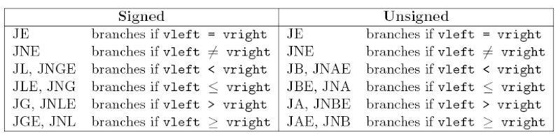

public:: true

- ## 前言
	- ### 資料來源
	- ### 以下介紹以 x86-64 下的 Linux 為主
- # 目錄
	- ((64981618-cf3a-4a74-a665-b7a87e89fcfc))
	- ((6515b921-a318-4fff-89d9-fcbbed177679))
	- ((651d3769-524a-4806-8524-b39ffbfe6b99))
	- ((6537c732-8a47-414b-aa29-2f13698bd4dd))
- # Nasm - Linux for X86-64
  id:: 64981618-cf3a-4a74-a665-b7a87e89fcfc
  collapsed:: true
	- ## 前言
		- ### 資料來源
			- https://cs.lmu.edu/~ray/notes/nasmtutorial/
			- https://www.cs.uaf.edu/2017/fall/cs301/reference/x86_64.html
			- https://www.yhspy.com/2020/06/25/%E2%80%9CLow-Level-Programming%E2%80%9D-%E8%AF%BB%E4%B9%A6%E7%AC%94%E8%AE%B0%EF%BC%88%E7%AC%AC%201-4%20%E7%AB%A0%EF%BC%89/
			- https://nasm-tutorial.akash.website/basic/register.html
			- https://ithelp.ithome.com.tw/articles/10227112
			- https://ithelp.ithome.com.tw/m/articles/10246804
			- https://ithelp.ithome.com.tw/users/20117397/ironman/3619?page=1
			- https://zh.m.wikibooks.org/zh-tw/X86%E7%B5%84%E5%90%88%E8%AA%9E%E8%A8%80/X86%E6%9E%B6%E6%9E%84%E5%8F%8A%E5%AF%84%E5%AD%98%E5%99%A8%E8%A7%A3%E9%87%8A
			- https://ianchen0119.web.nycu.edu.tw/2021/06/04/x86-assembly/
			- https://www.csie.ntu.edu.tw/~comp03/nasm/nasmdoc0.html
			- https://www.tutorialspoint.com/assembly_programming/index.htm
			- https://ctf-wiki.org/
			- https://jasonblog.github.io/note/linux_tools/er_jin_wei_shi_yong_cheng_5f0f28_objdump_,_readelf.html
		- ### 以下程式碼均以Intel格式撰寫，Intel和AT&T格式的差別在相應章節有做說明
	- ## 編譯
	  collapsed:: true
		- ### 在linux x86-64系統下的nasm編譯器
		- ```shell
		  #編譯為.o(目標文件)，-f指定文件格式，-o指定輸出名稱
		  nasm -f elf64 -o objectfile.o codefile.asm
		  
		  #使用ld(連結器)將單個或多個目標文件製作成一個執行檔
		  ld objectfile.o -o runfile
		  ```
	- ## registers [暫存器]
	  collapsed:: true
		- ### 為何要使用registers
			- 
				- ##### 取自: https://hackmd.io/@sysprog/c-memory?type=view
			- ### 如果不使用registers，而是將資料存在於stack和heap的話，資料將存於Cache[快取]或Memory中，程式執行速度也將會變慢許多
		- |64 bits (long)|32 bits (int)|16 bits (short)|8 bits (char)|
		  |-------|-------|------|------|
		  |<p style="color: red">rax aka r0</p>|eax|ax|ah 和 al|
		  |<p style="color: red">rcx aka r1</p>|ecx|cx|ch 和 cl|
		  |<p style="color: red">rdx aka r2</p>|edx|dx|dh 和 dl|
		  |<p style="color: red">rbx aka r3</p>|ebx|bx|bh 和 bl|
		  |<p style="color: red">rsp aka r4</p>|esp|sp|<p style="color: red">spl</p>|
		  |<p style="color: red">rbp aka r5</p>|ebp|bp|<p style="color: red">bpl</p>|
		  |<p style="color: red">rsi aka r6</p>|esi|si|<p style="color: red">sil</p>|
		  |<p style="color: red">rdi aka r7</p>|edi|di|<p style="color: red">dil</p>|
		  |<p style="color: red">r8</p>|<p style="color: red">r8d</p>|<p style="color: red">r8w</p>|<p style="color: red">r8b</p>|
		  |<p style="color: red">r9</p>|<p style="color: red">r9d</p>|<p style="color: red">r9w</p>|<p style="color: red">r9b</p>|
		  |<p style="color: red">r10</p>|<p style="color: red">r10d</p>|<p style="color: red">r10w</p>|<p style="color: red">r10b</p>|
		  |<p style="color: red">r11</p>|<p style="color: red">r11d</p>|<p style="color: red">r11w</p>|<p style="color: red">r11b</p>|
		  |<p style="color: red">r12</p>|<p style="color: red">r12d</p>|<p style="color: red">r12w</p>|<p style="color: red">r12b</p>|
		  |<p style="color: red">r13</p>|<p style="color: red">r13d</p>|<p style="color: red">r13w</p>|<p style="color: red">r13b</p>|
		  |<p style="color: red">r14</p>|<p style="color: red">r14d</p>|<p style="color: red">r14w</p>|<p style="color: red">r14b</p>|
		  |<p style="color: red">r15</p>|<p style="color: red">r15d</p>|<p style="color: red">r15w</p>|<p style="color: red">r15b</p>|
			- ### 紅色標示為相較於x86-32的暫存器，x86-64所新增的暫存器
			- ### 各暫存器介紹
				- ### Data Registers
					- ### rax: Accumulator[累加器]，算術指令中使用的一種累加器，也會作為系統調用的序號(告訴系統要執行的命令)，和返回值的容器。
					- ### rcx: Cycle，最為迴圈的計數器。
					- ### rdx: Data，儲存輸入/輸出操作期間的數據，通常也作為系統調用中參數傳遞的暫存器(第三個參數)。
					- ### rbx: Base，基址暫存器，用於儲存早期處理器模型中的基址。
					- ### r8~r15: 通常用於儲存臨時變數。
				- ### Pointer Registers
					- ### rsp: Stack，指向堆疊頂端的指位器。
					- ### rbp: Stack Base，指向堆疊底端的指位器，也被用於框指標。
				- ### Index Registers
					- ### rsi: Source Index，字串操作中的源索引指位器，也作為系統調用中參數傳遞的暫存器(第二個參數)。
					- ### rdi: Destination Index，字串操作中的目標索引指位器，也作為系統調用中參數傳遞的暫存器(第一個參數)。
				- ### Control Registers
					- ### rip: 唯一64位指位器，永遠儲存下一步要執行指令的位址。(EIP: 32位、IP: 16位)
					- ### Flag 狀態暫存器:
						- ### 儲存著反映當前程式執行狀態的標誌
						- ### rflags(全64位)、eflags(低32位)、flags(低16位)
						- 
							- ##### 取自: https://stackoverflow.com/questions/31026000/gdb-info-registers-command-second-column-of-output
						- ### `待補充`各旗標意義
							- ### AF: 輔助進位旗標
							- ### CF: 進位旗標，無號數做運算時過大或過小時為1，反之為0(像是無號數的OF)
							- ### OF: 溢位旗標
							- ### SF: 符號(負號)旗標
							- ### PF: 奇偶旗標，目前指令的計算結果有偶數個1則PF=1，反之PF=0
							- ### ZF: 零值旗標
							- ### DF: 方向旗標，決定字串讀取時由記憶體位址的高位讀到低位(小端序)還是低位讀到高位(大端序)，DF=0時為小端序，反之DF=1為大端序
							- ### IF: 中斷旗標
							- ### TF: 單步旗標
						- ### Flags暫存器會以2進制儲存上述的狀態
							- ### 例: 0000000000000000000001000000110為[PF IF]狀態，此狀態表示上一個運算的結果為奇數，並且現在程式處於暫停狀態。
						- ### 補充影片: {{video https://www.youtube.com/watch?v=cE2JuWzaJXo}}
				- ### `待補充` Segment Registers [段暫存器]
					- ### 大小均為16bits
					- ### CS: Code Segment，紀錄程式開始的位置
					- ### DS: Data Segment，紀錄資料從記憶體的哪個位置開始放
					- ### SS: Stack Segment，紀錄stack底部位置(stack開始存放東西)
					- ### ES: Extra Segment，額外的segment
					- ### FS: General Purpose Segments
					- ### GS: General Purpose Segments
		- ### 電腦會根據呼叫的暫存器來取得相對應大小的區塊
			- {:height 251, :width 668}
				- ##### 取自: https://cs.lmu.edu/~ray/notes/nasmtutorial/
		- ### 也可以想成這樣 (x86-32的形式)
			- 
				- ##### 取自: https://nasm-tutorial.akash.website/basic/register.html
		- ### 由於r0~r7等暫存器呼叫方式較新，所以要使用需要
			- ```nasm
			  %use altreg
			  ```
			- ### 範例:
				- ```nasm
				  section .data
				  	message db "Hello World", 10
				  
				  section .text
				  	global _start
				  
				  %use altreg ;啟用新版暫存器呼叫方式
				  
				  _start:
				  	mov rax, 1
				  	mov r7, 1 ;新版暫存器呼叫方式
				  	mov rsi, message
				  	mov rdx, 12
				  	syscall
				  
				  	mov rax, 60
				  	mov rdi, 0
				  	syscall
				  ```
		- ### `待補充`浮點數暫存器
			- 
				- ##### 取自: [wikimedia](https://commons.wikimedia.org/wiki/File:AVX_registers.svg)
			- ### 補充影片
				- {{video https://www.youtube.com/watch?v=FAKJset0qtw}}
				- {{video https://www.youtube.com/watch?v=zbsiq1n230E}}
	- ## Immediate Operands
	  collapsed:: true
		- ### 方法有很多種，以下取自官方的實例
		- ```nasm
		  200          ; decimal
		  0200         ; decimal - the leading 0 does not make it octal
		  0200d        ; decimal - d suffix
		  0d200        ; decimal - 0d prefex
		  0c8h         ; hex - h suffix, but leading 0 is required because c8h looks like a var
		  0xc8         ; hex - the classic 0x prefix
		  0hc8         ; hex - for some reason NASM likes 0h
		  310q         ; octal - q suffix
		  0q310        ; octal - 0q prefix
		  11001000b    ; binary - b suffix
		  0b1100_1000  ; binary - 0b prefix, and by the way, underscores are allowed
		  ```
	- ## Defining Data
	  collapsed:: true
		- |Bits|Bytes|Access memory|Allocate mamory|
		  |---|---|---|---|
		  |8|1|byte [ptr]|db|
		  |16|2|word [ptr]|dw|
		  |32|4|dword [ptr]|dd|
		  |64|8|qword [ptr]|dq|
		  |80|10|tword [ptr]|dt|
		  |128|16|oword [ptr]|do|
		  |256|32|yword [ptr]|dy|
		  |512|64|zword [ptr]|dz|
		- ### 範例
			- ```nasm
			  .data
			  	data_1: 	db    0x55                ; just the byte 0x55 
			  	data_2:		db    0x55,0x56,0x57      ; three bytes in succession 
			  	data_3:		db    'a',0x55            ; character constants are OK 
			  	data_4:		db    'hello',13,10,'$'   ; so are string constants 
			  	data_5:		dw    0x1234              ; 0x34 0x12 
			  	data_6:		dw    'a'                 ; 0x61 0x00 (it's just a number) 
			  	data_7:		dw    'ab'                ; 0x61 0x62 (character constant) 
			  	data_8:		dw    'abc'               ; 0x61 0x62 0x63 0x00 (string) 
			  	data_9:		dd    0x12345678          ; 0x78 0x56 0x34 0x12 
			  	data_10:	dd    1.234567e20         ; floating-point constant 
			  	data_11:	dq    0x123456789abcdef0  ; eight byte constant 
			  	data_12:	dq    1.234567e20         ; double-precision float
			      data_13:	dt    1.234567e20         ; extended-precision float
			     
			  .text
			  	global _start
			  _start:
			  	mov al, byte [data_1]
			      ...略
			  ```
	- ## Reserving Space [預留空間]
	  collapsed:: true
		- ### 如果想要預留為定義的空間[without initializing]，可以`.bss`區塊使用以下指令創建
		- |指令|Purpose[目的]|
		  |---|---|
		  |resb|保留一個byte|
		  |resw|保留一個word(2 bytes)|
		  |resd|保留一個doubleword(4 bytes)|
		  |resq|保留一個quadword(8 bytes)|
		- ### 範例
			- ```nasm
			  .bss
			  	buffer:          resb    64              ; reserve 64 bytes
			  	word_var:        resw    1               ; reserve a word
			  	real_array:      resq    10              ; array of ten reals
			  
			  .text
			  	global _start
			  _start:
			  	mov ax, [word_val]
			      ...略
			  ```
	- ## Endianness [位元組順序]
	  collapsed:: true
		- ### 組成多位元組的word的位元組的排列順序
		- ### x86架構實作為小端序
		- ### Little-endian [小端序]
			- ### 最低位的byte會放在最低的記憶體位址上
			- {:height 363, :width 655}
				- ##### 取自: https://ithelp.ithome.com.tw/m/articles/10246804
		- ### Big-endian
			- ### 最高位的byte會放在最低的記憶體位址上
			- 
				- ##### 取自: https://ithelp.ithome.com.tw/m/articles/10246804
	- ## Memory Operands [記憶體操作]
	  collapsed:: true
		- ### x86 的地址: 32位元為4 bytes，64位元全部為8 bytes，但64位元其實主要只有48bites的地址<因為64位元位址的高16bites基本上不能使用>
		- ### basic forms of addressing(用於取出相對應位置、暫存器或變數等內的數值)
			- ### [number]
			- ### [registers]
			- ### [registers + registers*scale]
				- ### 此處的scale只能是1、2、4、8等數
			- ### [registers + number]
			- ### [registers + registers*scale + number]
		- ### 範例
			- ```nasm
			  [750]                  ; displacement only
			  [rbp]                  ; base register only
			  [rcx + rsi*4]          ; base + index * scale
			  [rbp + rdx]            ; scale is 1
			  [rbx - 8]              ; displacement is -8
			  [rax + rdi*8 + 500]    ; all four components
			  [rbx + counter]        ; uses the address of the variable 'counter' as the displacement
			  ```
	- ## 陣列
	  collapsed:: true
		- ### 在.data區段下可以利用逗號隔開資料來製作陣列資料結構
			- ```nasm
			  section .data
			  	array: 	db 	0x15,0x15,0x15 		; 3個1byte的陣列(裡面均放入0x15)
			  ```
		- ### 使用""創建的字串資料結構其實也是利用字元陣列進行儲存
			- ```nasm
			  section .data
			  	string:	db	"abc",10,0 ; 16進制會顯示為0x616263100，10為換行符，0為字串結束符'\0'
			  ```
		- ### 在.bss區段下可以像系統申請不同長度的預留空間，來實作陣列資料結構
			- ```nasm
			  section .bss
			  	array:	resb	3	; 3個1byte的陣列(裡面資料未初始化)
			  ```
	- ## 呼叫約定 [calling convention]
	  collapsed:: true
		- ### 編譯器約定的各函式之間傳遞參數的規定，以下為x86架構下常見的呼叫約定
		- ### 32位元
			- ### __cdecl: 參數從右至左存入堆疊中，呼叫完畢後，由呼叫者將存入的參數清除，回傳值存在eax中，大部分x86的c語言程式都在使用此約定
			- ### __stdcall:參數從右至左存入堆疊中，呼叫完畢後，由被呼叫者將存入的參數清除，回傳值存在eax中，windows的很多API都使用此方式提供
			- ### __thiscall: 為類別方法專門設計最佳化的呼叫約定，將類別方法的this指標放在ecx暫存器中，然後將其餘參數存入堆疊中
			- ### __fastcall: 為加速呼叫而生的呼叫約定，將第一個參數放在ecx，將第二個參數放在edx中，然後將後續參數從右至左存入堆疊中
		- ### 64位元
			- ### Microsoft x64(windows): 依次將前四個參數存入rdi, rsi, rdx, rcx，剩餘參數從右至左存入堆疊中
			- ### SystemV x64(linux、macOS): 依次將前六個參數存入rdi, rsi, rdx, rcx, r8, r9，剩餘參數從右至左存入堆疊中
	- ## 指令 [Instructions]
	  collapsed:: true
		- ### 格式
		  collapsed:: true
			- ### Intel 格式
				- ```nasm
				  OpCode | Opearand
				  -------|---------
				  mov    | eax,0xA
				  push   | 0x0
				  pop    | rax
				  ```
			- ### AT&T 格式
				- ```nasm
				  OpCode | Opearand
				  -------|---------
				  mov    | $0xA,%eax
				  push   | $0x0
				  pop    | %rax
				  ```
			- ### 通常來講，組合語言指令不區分大小寫，但是標籤名稱(global _start)和區塊名稱(section .data)區分大小寫。
		- ### Hello World範例
		  collapsed:: true
			- ~~~nasm
			  section .data
			  	message db "Hello World", 10
			  
			  section .text
			  	global _start
			  
			  _start:
			  	mov rax, 1
			      mov rdi, 1
			      mov rsi, message
			      mov rbx, 12
			      syscall
			      
			      mov rax, 60
			      mov rdi, 0
			      syscall
			  ~~~
		- ### section [segment 也是同等的指令]將指定其下面程式碼儲存的區塊(主要分為以下幾個區塊)
		  collapsed:: true
			- ### .data: 用來定義常數或初始化的值(可修改)
			- ### .rdata: 用來定義常數或初始化的值(不可修改)
			- ### .bss: 用於保存變數(未初始化)，不會占用ELF空間，當程式執行時才會向系統申請空間(程式檔案只會儲存申請資料空間的指令)
			- ### .plt 與 .got: 程式呼叫動態連結程式庫中的函式時，會需要此兩個節配合，以取得被呼叫函式的位址
			  collapsed:: true
				- ### GOT 表和 PLT 表
					- ### GOT（Global Offset Table，全域偏移表）是Linux ELF檔案中用來定位全域變數和函數的一個表。
					- ### PLT（Procedure Linkage Table，過程連結表）是Linux ELF檔案中用來延遲綁定的表，也就是函數第一次被呼叫的時候才進行綁定
			- ### .text: 為主要的程式碼區塊
		- ### [nasm x86-64指令表](https://www.felixcloutier.com/x86/)
		- ### Assembler Directives
			- ### 補充連結:
				- https://www.csie.ntu.edu.tw/~comp03/nasm/nasmdoc5.html
				- https://www.tortall.net/projects/yasm/manual/html/nasm-directives.html
		- ### Linux System Call Table
			- ### 補充連結:
				- https://blog.rchapman.org/posts/Linux_System_Call_Table_for_x86_64/
				- https://x86.syscall.sh/
		- ### basic operator
			- ### mov x, y
			  collapsed:: true
				- ### x = y
				- ### 兩個參數的size要一樣
			- ### movzx x, y
			  collapsed:: true
				- ### 僅能用於 unsigned integer
				- ### y的size比x小時可以用MOVZX將y的值放到x內，不夠的部分會用0補到和x一樣大
				- ### y的size一定要小於x，等於也不行
			- ### lea x, y
			  collapsed:: true
				- ### 將y的地址存放進x中
			- ### and x, y
			  collapsed:: true
				- ### x = x and y
			- ### or x, y
			  collapsed:: true
				- ### x = x or y
			- ### xor x, y
			  collapsed:: true
				- ### x = x xor y
			- ### add x, y
			  collapsed:: true
				- ### x = x + y
			- ### sub x, y
			  collapsed:: true
				- ### x = x – y
			- ### inc x
			  collapsed:: true
				- ### x = x + 1
			- ### dec x
			  collapsed:: true
				- ### x = x – 1
			- ### syscall
			  collapsed:: true
				- ### [系統呼叫](https://zh.wikipedia.org/zh-tw/%E7%B3%BB%E7%BB%9F%E8%B0%83%E7%94%A8)
				- ### [linux x86-64系統呼叫調用表](http://blog.rchapman.org/posts/Linux_System_Call_Table_for_x86_64/)
			- ### push src
			  collapsed:: true
				- ### 將src推入stack
			- ### pop dest
			  collapsed:: true
				- ### 將stack最上層數據取出給dest
			- ### call fun
			  collapsed:: true
				- ### 調用函數，並將呼叫函數指令的下一行的位址傳入stack，以此可以實現函數返回
				- ### ret
				  collapsed:: true
					- ### 尋找stack頂端儲存的位址，返回至該位址之程序
					- ### 主要分為retn和 retf， ret由彙編器編碼為前兩個之一
					- ### 不同之處在於 retn(return close)只會彈出指令指針 (IP)，而retf(return far)將彈出指令指針(IP)和代碼段(CS)
				- ### ret x
				  collapsed:: true
					- ### 在返回呼叫函數的同時，將rsp加上x值，此作法可視為將被呼叫函數的stack區塊都pop掉
			- ### jmp label
			  collapsed:: true
				- ### 跳轉到label標籤下的指令，無法函數返回
			- ### mul src
			  collapsed:: true
				- ### rax = rax * src
				- ### 如果超過64 bits的部分將存入rdx
			- ### div src
			  collapsed:: true
				- ### rax = rax / src
				- ### 如果餘數將存入rdx
			- ### cmp x, y
			  collapsed:: true
				- ### 將x減掉y但是不保存運算完的值，只改動eflags
				- ### 無法函數返還
				- ### 以下為條件跳轉
				- 
					- ##### 取自: http://godleon.blogspot.com/2008/02/comparisons-assembly-cmp-cmp-cmp-vleft.html
				- 
					- ##### 取自: http://godleon.blogspot.com/2008/02/comparisons-assembly-cmp-cmp-cmp-vleft.html
				- ### 範例
					- ```nasm
					  cmp     eax, 0      ;比較 EAX 與 0(若相同則 ZF=0，不相同則 ZF=1)
					  jz      fun   		;ZF=0，跳躍至 fun
					  ```
					- ```nasm
					  cmp     eax, 5		;比較eax與5的關係
					  jge     fun			;如果eax大於等於5就進行跳轉
					  ```
			- ### test x, y
			  collapsed:: true
				- ### x和y做and，但x和y的值不會改變，只會影響flag的狀態
			- ### 迴圈指令
			  collapsed:: true
				- ### loop loop_fun
					- ### rcx - 1，若rcx > 0，繼續下一個迴圈
				- ### loope loop_fun 或 loopz loop_fun
					- ### rcx - 1，若rcx > 0且ZF=1，繼續下一個迴圈
				- ### loopne loop_fun 或 loopnz loop_fun
					- ### rcx - 1，若rcx > 0且ZF=0，繼續下一個迴圈
			- ### extern c_fun
			  collapsed:: true
				- ### 匯入c語言函式(或rust lang等底層語言的函式)
					- ### 參數傳遞均遵守組合語言的呼叫約定執行
				- ### 補充連結
					- https://github.com/monad/rust-calling-assembly-calling-rust
				- ### 補充影片
					- {{video https://www.youtube.com/watch?v=oeo-hKxsAMo&list=PL2EF13wm-hWCoj6tUBGUmrkJmH1972dBB&index=21&pp=iAQB}}
					- {{video https://www.youtube.com/watch?v=jDZuTpCE8l8&list=PL2EF13wm-hWCoj6tUBGUmrkJmH1972dBB&index=22&pp=iAQB}}
			- ### %include "other_file"
			  collapsed:: true
				- ### 可以將外部檔案資料加入程式中，像.asm、.s、.inc、.mac等副檔名的檔案
				- ### nasm的-I指令可以告訴編譯器其他檔案儲存的位置
				- ### 防止多次include的方式
					- ```nasm
					  %ifndef MACROS_MAC
					      %define MACROS_MAC
					      ; now define some macros
					  %endif
					  ```
				- ### 補充連結
					- https://www.tortall.net/projects/yasm/manual/html/nasm-include.html
			- ### nop
				- ### 1個byte的佔位符，不做任何事。
		- ### jump vs call
		  collapsed:: true
			- https://www.geeksforgeeks.org/difference-call-jump-instructions/
		- ### 部分指令後面加上ss可轉為單精度浮點數[Scalar Single Precision Floating-Point Values]計算
		  collapsed:: true
			- ### addss xmm0, xmm1
		- ### 部分指令前面加上i代表針對有符號數的指令
		  collapsed:: true
			- ### imul x, y
				- ### 有符號數的乘法
	- ## 堆疊
	  collapsed:: true
		- ### 補充連結
			- https://en.wikibooks.org/wiki/X86_Disassembly/The_Stack
			- https://blog.gtwang.org/programming/memory-layout-of-c-program/
			- https://manybutfinite.com/post/anatomy-of-a-program-in-memory/
		- ### 記憶體配置
			- 
				- ##### 取自: https://blog.gtwang.org/programming/memory-layout-of-c-program/
			- ### 可以看到Stcak和Heap從高位址和低位址兩個方向蠶食尚未使用的區域
			- ### 此處的Stack即為本章節要講述的堆疊
			- ### Heap則是用來儲存動態初始化的資料
		- {:height 595, :width 748}
			- ##### 取自: https://grandidierite.github.io/functions-and-stack-in-NASM-32-bit/
		- ### 在x86組合語言中堆疊沒有空堆的概念，代表在任意時間都可以利用pop指令取得一個值，只是這些值將沒有意義
		- ### 堆疊由高位址往低位址添加資料，但多byte的資料會以小端序由低位址往高位址添加
			- ```nasm
			  mov dword [rsp], 0x12345678
			  (GDB) x/4xb $rsp => 0x78 0x56 0x34 0x12
			  					(+0) (+1) (+2) (+3)
			  
			  mov dword [rsp-0x4], 0x87654321
			  (GDB) x/-4xb $rsp => 0x21 0x43 0x65 0x87
			  					 (-4) (-3) (-2) (-1)
			  ```
	- ## 函式
	  collapsed:: true
		- ### 堆疊空間分配
			- ### 組合語言中的區域變數實作是利用在堆疊中分出一個區塊給每個函式來進行儲存，所以稱為堆疊框
			- ### 因為每次分配到的位址是不固定的，但堆疊框的偏移量是固定的，所以組合語言利用rbp作為堆疊框的基址，以此為基底便可參考所有的區域變數，稱為框指標
			- ### 由於父函式也需要使用rbp當作框指標，所以每個函式初始化階段時需要先將父函式的框指標推入堆疊中，再將rbp指向自己堆疊框的值，這樣的流程就是函式最常見的開頭
				- ```nams
				  fun:
				  	push rbp		; save old rbp value
				      mov rbp, rsp
				      sub rsp, 0x10	; 常見會先將rsp減去需要的區域變數長度來先隔開堆疊框的區域，
				      				; 再利用rbp去隊要修改或讀取的空間進行參考，此例子先隔開了
				                      ; 長度為16bytes(128bits)大小的區塊作為fun函式的區域變數空間。
				      
				      mov rsp, rbp 	; remove space for local vars
				  	pop rbp 		; restore old EBP value
				  	ret 			; return
				  ```
			- 
				- ##### 取自: https://ianchen0119.web.nycu.edu.tw/2021/06/04/x86-assembly/
			- ### `待補充`現今編譯技術的進步，也出現了不使用rbp(框指標)作為區域變數的基址，而直接透過rsp進行參考的最佳化方式
		- ### 補充影片
			- {{video https://www.youtube.com/watch?v=faMLkpC8TmA}}
	- ## Process [行程] and Thread [線程]
	  id:: 65617b4b-c7c7-44de-811e-11afc422993c
	  collapsed:: true
		- ### Process
			- ### 每個 process 都有自己獨立的地址空間、數據棧和其他跟蹤行程的輔助數據，當要讓兩個以上的 process 進行通訊時，必須通過行程間通訊機制 < IPC, inter-process communication >來實現數據共享，具體方法有管道、訊號、套接字、共享內存區 [ shared memory ]等。
		- ### Multiprocess
		  id:: 655f7beb-79b7-46be-af35-47e46be64847
		  collapsed:: true
			- ### 補充:
				- https://undo.io/resources/gdb-watchpoint/multiprocess-debugging-gdb
			- ### C lang 中的 fork <在 Linux 環境下>會向系統呼叫一個子 process，在主 process 中，fork 的回傳變數會接收到子 process 的 PID，而子 process 中 fork 的回傳變數則接收到 0
		- ### Multithread
		  id:: 6560bb83-5a07-4ff8-8afd-12ebae91abe6
		  collapsed:: true
			-
- # PWN
  id:: 6515b921-a318-4fff-89d9-fcbbed177679
  collapsed:: true
	- ### 補充連結
		- https://tech-blog.cymetrics.io/posts/crystal/pwn-intro/
	- ### 通過shllcode等指令，造成程式buffer overflow，以此取得shell的使用權限。
	- ### 記憶體保護機制
	  collapsed:: true
		- ### canary
			- ### 一個放在 stack 上的隨機值，位置在 old rbp 跟 return address 之前，會在函數要結束的時候被檢查值是否被更動，作為判斷是否有 overflow 的依據。
		- ### fortify
			- ### 編譯時，compiler 會對可預知長度且與 libc 函數呼叫有關的變數做長度上限的檢查，如果執行時發現有越界的函數，程式就會強制結束。
		- ### NX
			- ### Non-Executable，強制【可寫段不可執行，可執行段不可寫】的原則，也就是無法直接寫 shellcode 然後執行，以及不能竄改可執行的區段。
		- ### PIE
			- ### Position Independent Executable，讓記憶體區段隨機分配，所以執行前沒辦法準確知道 base address 的位置，也就推算不出函數與變數的地址。
			- ### Address space layout randomization <ASLR>
				- ### 位址空間組態隨機載入，通過隨機放置行程關鍵資料區域的定址空間來防止攻擊者能可靠地跳轉到記憶體的特定位置來利用函數，以防範對已知位址進行Return-to-libc攻擊
		- ### RELRO
			- ### Relocation Read-Only，代表 binary 中的 header 在 linker 執行完後會是 read-only，如果是 FULL RELRO 甚至連 GOT 表也會一開始填好並變成唯讀。
		- ### RWX
			- ### 當標示為 Has RWX segments 表使存在可讀、可寫、可執行的片段
	- ### stack-based buffer overflow
		- 
			- ##### 取自: https://tech-blog.cymetrics.io/posts/crystal/pwn-intro/
	- ### pwntool
	  collapsed:: true
		- ### 載入程式
		  collapsed:: true
			- ### rev = process(file)
				- ### file is string
				- ### 從本地啟動程式
				- ### rev = process(["file", "arg1", "arg2", ...])
			- ### rev = gdb.debuge(file, Log_level="debug")
				- ### file is string
				- ### 從本地啟動程式，並啟動GDB進行偵錯
			- ### rev = remote(ip, port)
				- ### ip is string
				- ### port is int
				- ### 從遠端啟動程式
			- ### rev = ssh(host = ip, user = name, port = port, password = pass)
				- ### ip is string
				- ### name is string
				- ### port is int
				- ### pass is string
				- ### rev_p = rev.process(file)
					- ### 遠端連線的任意 fd 輸入都可以直接用 send 進行
		- ### context.log_level = "debug"
			- ### 開啟日誌紀錄
		- ### p32(message) / p64(message)
			- ### 將整數包成32或64位元的字符串
		- ### u32(message) / u64(message)
			- ### 將32或64位元的字符串解碼成整數
		- ### 發送數據
		  collapsed:: true
			- ### rev.send(data)
			- ### rev.sendline(data)
			- ### rev.sendlineafter('> ', data)
		- ### 接收數據
		  collapsed:: true
			- ### rev.recv(numb = 2048, timeout = default)
				- ### 接收數據，numb為byte大小，timeout為計時
			- ### rev.recvline(keepends=True)
				- ### 接受一行數據，keepends表示是否保留結尾\n
			- ### rev.recvuntil(message,drop=fasle)
				- ### message is string
				- ### 接收數據直到設置的message出現
			- ### rev.recvall()
				- ### 接收數據直到EOF
			- ### rev.recvrepeat(timeout = default)
				- ### 接收數據直到EOF或是超時
		- ### rev.interactive()
			- ### 直接與程式交互，在取得shell後使用
		- ### 生成shellcode
		  collapsed:: true
			- ### context(arch='i386', os='linux')
				- ### 設置shellcode架構
			- ### asm('mov eax, 0')
				- ### 生成機械語言
			- ### disasm('\xb8\x0b\x00\x00\x00')
				- ### 反組譯回組合語言
		- ### gdb.attach(point)
			- ### 設置中斷點，觸碰到中斷點後程式及會中斷
		- ### checksec file
			- ### 檢測程式使用了哪些保護措施
- # GDB
  id:: 651d3769-524a-4806-8524-b39ffbfe6b99
  collapsed:: true
	- ## 前言
		- ### 資料來源
	- # 目錄
- # objdump
  id:: 6537c732-8a47-414b-aa29-2f13698bd4dd
  collapsed:: true
	- ### 補充連結
		- https://ivanzz1001.github.io/records/post/linux/2018/04/09/linux-objdump
	- ## 指令
	  collapsed:: true
		- ### -M intel intel-mnemonic
			- ### 改變instruct 為 intel style
			- ### 改變註記詞為 intel style
		- ###  -f
			- ### 顯示程式的 File headers 資訊
		- ### -p
			- ### 顯示程式專屬訊息，像各區段偏移量、起始位址、大小和權限，也顯示動態連結庫函式起始位址
		- ### -h
			- ### 顯示各區段大小、起始位址、偏移量
		- ### -x
			- ### 顯示 File headers 的完整資訊
		- ### -d
			- ### 只對程式碼區段進行反組譯
		- ### -D
			- ### 對所有區段進行反組譯
		- ### -s
			- ### 只對所有區段的內容
		- ### -S
			- ### `待補充`
			-