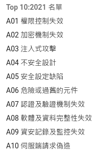

public:: true

- ## 前言
- # 目錄
	- ((65d542fa-52c2-4466-97bc-27ba548ff47d))
- # 資通安全技術概論
  id:: 65d542fa-52c2-4466-97bc-27ba548ff47d
  collapsed:: true
	- ## 網路安全 （25%）
	  collapsed:: true
		- ### 常見網路攻擊手法之基本觀念
			- ### 勒索病毒
			- ### 阻斷服務
			- ### Buffer Overflow
			- ### Replay Attack
			- ### SQL Injuction
			- ### Phishing
			- ### CSRF
			- ### XSS
		- ### 防火牆之基本觀念
		- ### 入侵偵測系統之基本觀念
		- ### 攻擊模式
			- ### 主動攻擊 （Active Attack）
				- ### 企圖破壞系統的架構、功能與資源會竊取系統資料
				- ### 典型手法
					- ### 偽裝攻擊 （Masquerade attack）
						- ### 攻擊者利用合法使用者的身份與權限進入系統
						- ### 防禦方法：加強系統的身份驗證機制
					- ### 修改訊息內容攻擊（Modification of message content）
						- ### 竄改傳輸中或儲存於系統的資料，使系統接收錯誤訊息，以破壞訊息完整性，企圖改變系統功能或安全狀態
					- ### 重送攻擊（Replay attack）
						- ### 通常需要運用多種攻擊之組合，如偽裝使用者身份進入系統，修改系統訊息，並重新送出，已達到攻擊之目的
						- ### 防禦方法：通過紀錄時間戳或密碼學技巧
					- ### 阻斷服務攻擊 （Denial of service attack, DoS attack）
						- ### 以阻斷或減緩網路設備之正常運作為主要目的，對於電子商務網站的服務常會造成重大損失
			- ### 被動式攻擊（Passive Attack）
				- ### 企圖竊取資訊，但以不影響系統運行為原則
			- ### 網路防火牆 （Network Firewall）
				- ### 網路存取控制的門戶
				- ### 防火牆之建置可以防衛內部電腦，避免被駭客利用作為攻擊跳板，可以避免不必要的網路連線，以提升區域網路之安全
				- ### 分類
					- ### 過濾型（Filtering）防火牆
						- ### 下面兩者之功能可能重疊，但並無衝突，有些防火牆同時具備兩種防火牆之功能
						- ### 網路層（Network Layer）防火牆
						- ### 應用層（Application Layer）防火牆
					- ### 代理型（Proxy）防火牆
			- ### 非軍事區（Demiltarized Zone, DMZ）
				- {:height 252, :width 520}
					- ##### 取自: https://www.techtarget.com/searchsecurity/definition/DMZ
				- ### 透過防火牆以建制可信賴的企業內部網路環境，防火牆通常建置於網際網路與企業網路之間，並且通常有兩道防火牆以建置出非軍事區，其中可能會架設對外之服務伺服器會proxy等
			- ### 虛擬區域網路（Virtual Local Area Network, VLAN）
			- ### 虛擬私人網路（Virtual Private Network, VPN）
			- ### 無線區域網路（Wireless LAN, WLAN）
		- ### 網路設備與網路通訊之基本觀念
			- ### 如：OSI, SMTP, SSH, TLS, HTTPS, TCP/IP, IPSec傳輸模式等
			- ### [OSI and TCP/IP](657c2ecb-5110-45d4-a15a-bd3dc69eb208)
		- ### HTTPS
			- ### TLS
			- ### SSL
		- ### 資訊安全四特性
			- ### 機密性（Confidentiality）
				- ### 保護資料不被未授權的人員訪問
			- ### 可用性（Availability）
				- ### 保護資料不被未授權的人員訪問
			- ### 可靠性（Reliability）
				- ### 系統能夠在預期的情況下穩定運行
			- ### 不可否認性（Non-Repudiation）
				- ### 防止行為者在事後否認自己曾經做過某些行為
	- ## 作業系統與應用程式安全 （30%）
	  collapsed:: true
		- ### 作業系統安全
		  collapsed:: true
			- ### 重點
				- ### 作業系統的安全設定與防禦機制
				- ### 資安監控機制規劃與配置運維
					- ### 標的、方式、防禦作為、應變與通報、資安情資應用相關機制整合、配置與運維相關等
		- ### 作業系統與應用程式攻擊收法
		  collapsed:: true
			- ### 重點
				- ### 作業系統防禦機制之基本觀念
					- ### CAPTCHA
						- ### 俗稱：驗證碼
					- ### 參數過濾
					- ### Sandbox
				- ### 常見攻擊手法
					- ### DOS/DDOS
					- ### 重送攻擊
					- ### 猜測攻擊
					- ### 竄改
					- ### 資料竊聽（取）
					- ### 轉送攻擊
					- ### SQL injection
					- ### XSS
					- ### CSRF
						- ### Cross Site Request Forgery
						- ### 跨網站請求偽造攻擊
					- ### 社交工程
		- ### 程式與開發安全
		  collapsed:: true
			- ### 重點
				- ### 資安防護框架
					- ### 資安防禦縱深
					- ### 網路安全
					- ### 惡意程式分析
					- ### 應用系統安全（web安全）
					- ### 作業系統安全
					- ### PKI（公開金鑰基礎建設）/ 加解密機制（密碼學）
				- ### 資安防護機制配置
					- ### 防火牆
					- ### IPS
					- ### 防毒系統架構與配置
					- ### 封包分析相關概念與應用
					- ### 修補機制
				- ### SSDLC安全軟體開發流程與帳戶管理
				- ### 身份認證機制設計
				- ### 運營維護
				- ### OWASP 十大網頁應用弱點
				  collapsed:: true
					- ### TOP 10: 2021
						- 
							- ##### 取自: https://owasp.org/Top10/zh_TW/
					- ### TOP 10: 2017
					  collapsed:: true
						- ### 注入（Injection）
						  collapsed:: true
							- ### 攻擊形式
								- ### SQL 注入
								- ### OS 注入
								- ### LDAP 注入
								- ### NoSQL 注入
								- ### URL 注入
							- ### 成因
								- ### 當不可靠的資料被發送給解譯器時，欺騙解譯器，使之執行非法的命令或未恰當授權的資料存取
							- ### 應對策略
								- ### 用安全的API
								- ### 使用能過濾命令及查詢語句中特殊字元的解譯器
								- ### 使用適當規範的輸入驗證方法
								- ### 對於使用者及網頁進行輸入檢查
								- ### 使用最小權限原則
								- ### 預儲權限（Store procedures）
						- ### 敏感資料外洩（Sensitive Data Exposure）
						- ### 跨站腳本（Cross-Site Scripting, XSS）
							- ### Reflected XSS
							- ### Stored XSS
							- ### DOM XSS
								- ### Document Object Model
						- ### 跨站請求偽造（Cross-Site Request Forgery）
							- ### CSRF / XSRF
							- ### 利用挾持用戶在目前已登入的web應用程式上執行非本意操作的攻擊方式
							- ### 也稱為One-click attack, Session Riding
							- ### CSRF vs. XSS
								- ### XSS 利用的是用戶對指定網站的信任
								- ### CSRF利用的是網站對用戶網頁瀏覽器的信任
							- ### 防禦措施
								- ### Token 同步模式
								- ### 檢查Referer欄位
								- ### 添加校驗Token
								- ### 圖形驗證碼（CAPTCHA）
								- ### 增加操作前的確認畫面（如：電子郵件確認）
				- ### 弱點掃描
				- ### 滲透測試