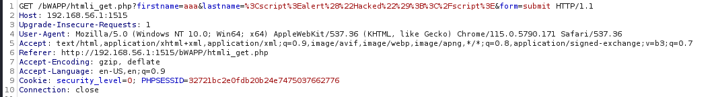
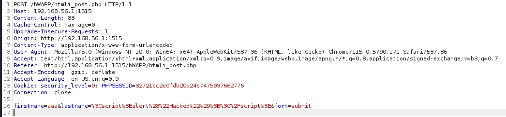

public:: true

- ## 前言
	- ### 資料來源
	- ### 以下靶機為bWAPP V2.2
		- http://www.itsecgames.com/
- # 目錄
	- ((65788256-fcae-46b9-914b-837714624bd9))
	- ((657ad571-09e7-4838-acc3-b6939f1eca40))
	-
- # HTML injection - Reflected (GET)
  id:: 65788256-fcae-46b9-914b-837714624bd9
  collapsed:: true
	- ## Low
		- ### source: htmli_get.php
		- ### 先備知識:
			- ### php 中可以利用 print, echo 等指令中內嵌 HTML code
				- 
		- ### 伺服器未對使用者輸入做任何檢查，導致 php 將輸入的字串轉成 HTML code ，並產生未預期結果
		- ```txt
		  <script>alert("Hacked");</script>
		  ```
		-
	- ## Medium
	- ### 伺服器增加了對 < 和 > 的檢查，如果有就會將其替換為 &lt; 和 &gt;
	- ```php
	  function xss_check_1($data)
	  {
	      
	      // Converts only "<" and ">" to HTLM entities    
	      $input = str_replace("<", "&lt;", $data);
	      $input = str_replace(">", "&gt;", $input);
	      
	      // Failure is an option
	      // Bypasses double encoding attacks   
	      // <script>alert(0)</script>
	      // %3Cscript%3Ealert%280%29%3C%2Fscript%3E
	      // %253Cscript%253Ealert%25280%2529%253C%252Fscript%253E
	      $input = urldecode($input);
	      
	      return $input;
	      
	  }
	  ```
	- ### 但伺服器在最後做了 url decode 會將 ascii code 轉成字元，所以可以將 ascii code 取代 < 和 >
	- ```txt
	  %3cscript%3ealert("Hacked");%3c/script%3e
	  ```
	-
	- ## High
	- ## Countermeasure
- # HTML injection - Reflected (POST)
  id:: 657ad571-09e7-4838-acc3-b6939f1eca40
  collapsed:: true
	- ### HTTP POST and GET difference
		- ### GET
			- ### 主要用於用戶端向伺服器請求資料時，指令會直接輸入於URL中
			- 
			- ### 而如果利用此 method 取得機密資料(密碼，session key)顯然是不安全的
		- ### POST
			- ### 主要用於用戶端提交資料給伺服器用，指令會在 HTTP request 的正文中
			- 