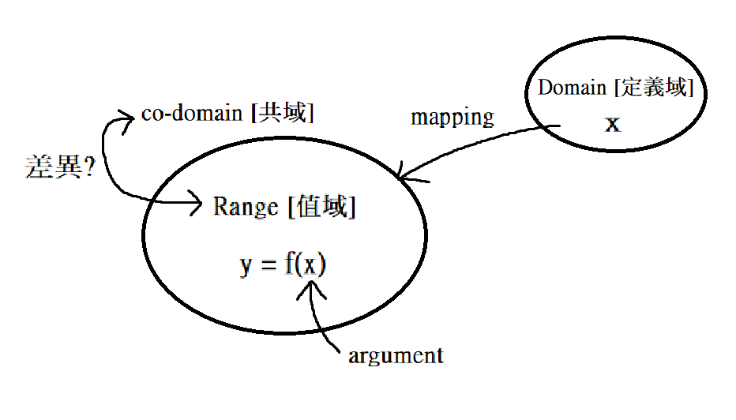
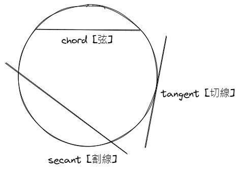
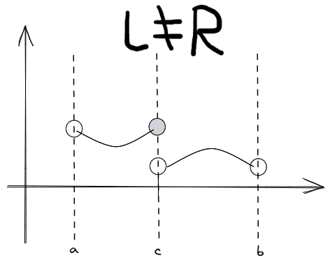
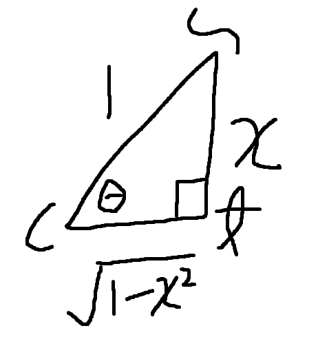

public:: true

- _(z-lib.org)_1666704625046_0.pdf)
	- [[hls__Essential_Calculus_Second_Edition_(James_Stewart)_(z-lib.org)_1666704625046_0]]
- # 目錄
  id:: 6357dbad-17db-4a85-b9d1-a3182f5492aa
	- ((6357ddcb-f684-4a4d-88e2-86bdee98de05)) 未寫完
	- ((638701e1-2c98-411c-93ff-d846f4c57075)) 未寫完
	- ((63870976-980d-427a-af95-699e77e63159)) 未寫完
	- ((638701e2-e487-4c37-b362-2d490423db55)) 未寫完
	- ((638701e2-cf9e-4deb-8b47-3773f1accc35))
	- ((63909d02-5697-4724-945e-166f3847cde0)) 未寫完
- # Chapter One - function and limits
  id:: 6357ddcb-f684-4a4d-88e2-86bdee98de05
  collapsed:: true
	- ## Intro:
		- ### calculus -> differential calculus, integral calculus
			- ### limits
				- ### deivatives [導數]
				- ### integrals [積分]
			- ### function <f(x)>
			- ### infinite series [無限級數]
	- ## Function:
	  collapsed:: true
		- {:height 129, :width 173}
		- ### independent variable [獨立變數]
		- ### dependent variable [相依變數]
		- ### representing [表示] a function:
			- ### algebraically [ 式子]
			- ### numerically [表格]
			- ### visually [圖] <the set of an ordered in a pair>
			- ### verbally <by a description [描述] a word>
		- ((6357f053-ac52-40d9-b25e-6d925b3a022c))
		- ### piecewise defined [分段定義] : $$\begin{Bmatrix} x \geq 0, x \leq 5 \\ x > 6, x \leq 7 \end{Bmatrix}$$
		- ### mathematical model [數學模型]
			- ### 線性函數:  $$ y = f(x) = mx + b $$
			- ### 多項式:  $$ P(x) = a_n x^n + a_{n-1} x^{n-1} + ... + a_2 x^2 + a_1 x + a_0 $$
			- ### 次方函數:  $$ f(x) = x^a $$
			- ### 有理函數:  $$ f(x) = \frac {P(x)} {Q(x)} $$
			- ### 代數函數:  $$ f(x) = \sqrt{x^2 + 1} $$
			- ### 超越函數 <not algebra>
				- ### 三角函數:  $$ f(x) = sin(x), g(x) = cos(x), ... $$
				- ### 指數函數:  $$ f(x) = a^x $$
				- ### 對數函數:  $$ f(x) = log_a x $$
		- ### trigonometric function [三角函數] :
			- | Function | Domain | Range |
			  | $$ y = \sin x $$ | $$ -1 \leq x \leq 1 $$ | $$ -\frac{\pi}{2} \leq y \leq \frac{\pi}{2} $$ |
			  | $$ y = \cos x $$ | $$ -1 \leq x \leq 1 $$ | $$ 0 \leq y \leq \pi $$ |
			  | $$ y = \tan x $$ | $$ -\infty < x < \infty $$ | $$ -\frac{\pi}{2} < y < \frac{\pi}{2} $$ |
			  | $$ y = \cot x $$ | $$ -\infty < x < \infty $$ | $$ 0 < y < \pi $$ |
			  | $$ y = \sec x $$ | $$ \mid x \mid \geq 1 $$ | $$ 0 \leq y \leq \pi, y \neq \frac{\pi}{2} $$ |
			  | $$ y = \csc x $$ | $$ \mid x \mid \geq 1 $$ | $$ -\frac{\pi}{2} \leq y \leq \frac{\pi}{2}, y \neq 0 $$ |
	- ## The tangent [切線]
	  collapsed:: true
		- 
		- ### slope $$ = \frac{y_Q - y_P}{x_Q - x_P} = \frac{\triangle y}{\triangle x} $$
		- 
		- ### tangent's slope $$ = \frac{0}{0} \to undefined \Rightarrow \displaystyle\lim_{\Delta x \to 0} \frac{\Delta y}{\Delta x}$$
		- ### ex:
			- ### $$\displaystyle\lim_{x \to 0} \frac{sin \ x}{x} \to \frac{sin \ x}{x} = \frac{0}{0} \to undefined \Rightarrow 羅必達定理 <上下各自微分>$$
		- ### ex:
			- ### $$\displaystyle\lim_{x \to 0} sin(\frac{\pi}{x}) \Rightarrow \theta = sin(\frac{\pi}{x}) \Rightarrow x \to 0, \theta \to \infty \Rightarrow does not exist$$
	- ## Limits
		- ### one-sided limits:
			- 
			- ### <左極線> $$\displaystyle\lim_{x \to c^{-}} f(x) = L$$
			- ### <右極線> $$\displaystyle\lim_{x \to c^{+}} f(x) = R$$
			- ### $$\displaystyle\lim_{x \to c} f(x) = L, if \ and \ only \ if \displaystyle\lim_{x \to c^{-}} f(x) = L \ and \displaystyle\lim_{x \to c^{+}} f(x) = L$$
		- ### infinite limits:
			- ### ex: vertical asymptote [垂直漸進線]
			- ### ex: find all the vertical asymptotes of $$y=tan(2 \cdot sinx)$$ where $$-\pi \leq x \leq \pi$$
		- ### the limits laws:
		  collapsed:: true
			- ### suppose $$\displaystyle\lim_{x \to a} f(x)$$ and $$\displaystyle\lim_{x \to a} g(x)$$ exist [存在], C is constant.
			- ### 1. $$\displaystyle\lim_{x \to a}(f(x) \pm g(x)) = \displaystyle\lim_{x \to a} f(x) \pm \displaystyle\lim_{x \to a} g(x)$$
			- ### 2. $$\displaystyle\lim_{x \to a}(C \times f(x)) = C \times \displaystyle\lim_{x \to a} f(x)$$
			- ### 3. $$\displaystyle\lim_{x \to a}(f(x) \times g(x)) = \displaystyle\lim_{x \to a} f(x) \times \displaystyle\lim_{x \to a} g(x)$$
			- ### 4. $$\displaystyle\lim_{x \to a}(\frac{f(x)}{g(x)}) = \frac{\displaystyle\lim_{x \to a}f(x)}{\displaystyle\lim_{x \to a}g(x)}, \displaystyle\lim_{x \to a} g(x) \neq 0$$
			- ### 5. $$\displaystyle\lim_{x \to a}(f(x))^n = (\displaystyle\lim_{x \to a} f(x))^n, n \in Z^+$$
			- ### 6. $$\displaystyle\lim_{x \to a} C = C$$
			- ### 7. $$\displaystyle\lim_{x \to a} x = a$$
			- ### 8. $$\displaystyle\lim_{x \to a} x^n = a^n, n \in Z^+$$
			- ### 9. $$\displaystyle\lim_{x \to a} \sqrt[n]{x} = \sqrt[n]{x}$$, if n is even, we assume that $$a > 0$$
			- ### 10. $$\displaystyle\lim_{x \to a} \sqrt[n]{f(x)} = \sqrt[n]{\displaystyle\lim_{x \to a} f(x)}, n \in Z^+$$
		- ### 夾擠定理:
			- ### 如果lim f(x) 一直算不出來，尋找兩個函數g(x)、r(x)，兩者的limit算得出來，並且左右夾住f(x)，即可算出limi f(x)。
		- ### 高斯函數:
			- ### [x]定義為不大於x的最大整數
			- ((63edef77-782a-4d9c-8512-01b82fc0f0fd))
		- ### Continuous [連續的]:
			- ### Interval [區間] (a, b): $$\displaystyle\lim_{x \to 0} f(x) = f(a)$$
				- ### 1. f, g is continuous functions
				- ### 2. a, c is constant
				- ### 3. $$f+g(v), f-g(v), f \cdot g(v), c \cdot f(v), \frac{f}{g}, g(a) \neq 0$$
		- ### precise definition of limit [limit的嚴謹定義]
			- ### $$\displaystyle\lim_{x \to a} f(x) = L$$
				- ((63edf939-49b0-4278-b9b8-d8bfe16acdec))
				- ### when $$\left| x - a \right| < \delta \Rightarrow such \ that \left| f(x) - L \right| < \varepsilon$$ (找出$$\varepsilon$$與$$\delta$$的關聯性，再使用$$\varepsilon$$找出$$\delta$$)
			- ### precise definition:
				- 待寫完
- # Chapter Two - derivatives
  id:: 638701e1-2c98-411c-93ff-d846f4c57075
  collapsed:: true
	-
- # Chapter Three - applications of differentiation
  id:: 63870976-980d-427a-af95-699e77e63159
  collapsed:: true
	-
- # Chapter Four - integrals
  id:: 638701e2-e487-4c37-b362-2d490423db55
  collapsed:: true
	-
- # Chapter Five - inverse functions
  id:: 638701e2-cf9e-4deb-8b47-3773f1accc35
  collapsed:: true
	- ## inverse function [反函數]
		- ### 例如 : $$f^{-1}()$$、$$sin^{-1}()$$ ...等
	- ## exponential function [指數函數]
	  collapsed:: true
		- ### 公式 : $$y = f(x) = a^{x}$$ <x is exponent>
		- ### 不等於 power function [次方函數] $$y = x^{a}$$
		- ### derivative of $$f(x) = a^{x}$$
			- ### 也就是要找$$f'(x) $$ or $$\frac{da^{x}}{dx}$$是多少
			- ### By definition:
				- $$f'(x) = \displaystyle\lim_{h \to 0} \frac{a^{x+h} - a^{x}}{h}$$
				- ### <將函數帶入>
				- $$\displaystyle\lim_{h \to 0} \frac{(a^{x} \times a^{h}) - a^{x}}{h}$$
				- ### <將$$a^{x}$$提出>
				- $$\displaystyle\lim_{h \to 0} \frac{a^{x}(a^{h} - 1)}{h}$$
				- ### <由於$$a^{x}$$與$$h$$並無關係，所以可以從limit中提出>
				- $$a^{x} \times \displaystyle\lim_{h \to 0} \frac{a^{h}-1}{h}$$
				- ### <$$\displaystyle\lim_{h \to 0} \frac{a^{h}-1}{h} = f'(0)$$，因為$$a^{0} = 1$$，所以$$ f'(0) = 1 \times \displaystyle\lim_{h \to 0} \frac{a^{h}-1}{h}$$>
				- $$\therefore f'(x) = a^{x} \times f'(0)$$
	- ## logarithmic function [對數函數]
		- ### 公式 : $$y = f(x) = log_{a}(x)$$
		- ### 對數函數為指數函數的反函數，也就是$$log_{a}(x)$$的$$f^{-1}(x) = a^{x}$$
			- ### 這使得$$log_{a}(a^{x}) = x$$ <$$log_{a}(\cdot)$$和$$a^{(\cdot)}$$兩函數可以抵銷>
	- ## natural exponential number [自然常數]
	  collapsed:: true
		- ### 找到a為一個數時，使得$$f'(0) = \displaystyle\lim_{h \to 0} \frac{a^{h}-1}{h} = 1$$
			- ### 當$$a=2$$時，$$f'(0) = \displaystyle\lim_{h\to0}{\frac{2^{h}-1}{h}} \approx 0.69$$
			- ### 當$$a=3$$時，$$f'(0) = \displaystyle\lim_{h\to0}{\frac{3^{h}-1}{h}} \approx 1.10$$
			- ### define :
				- ### 如果a = e，並且$$2 < e < 3$$
				- ### 使得$$f'(0) = \displaystyle\lim_{h\to0}{\frac{e^{h}-1}{h}} = 1$$
				- ### 那麼$$\frac{de^{x}}{dx} = e^{x} \times 1 = e^{x}$$
				- ### 並且因為$$\frac{de^{x}}{dx} = e^{x}$$，所以$$\int e^{x}dx=e^{x}+c$$
			- ### define中的e就是natural exponential number [自然常數]，也稱為Euler's number [尤拉數]，約等於2.71828
			- ### natural exponential function [自然指數函數]
				- $$y = e^{x} = exp(x)$$
			- ### natural logarithmic function [自然對數函數]
				- $$y = log_{e}(x) = ln(x)$$
				- ### $$log_{a}(x) = \frac{ln \ x}{ln \ a}$$
					- ### $$y = log_{a}(x)$$
					- ### <將左右各套入$$a^{(\cdot)}$$中>
					- ### $$a^{y} = a^{(log_{a}(x)}$$
					- ### <$$a^{(\cdot)}$$可以與$$log_{a}(\cdot)$$抵銷>
					- ### $$a^{y} = x$$
					- ### <兩邊各自套入$$ln(\cdot)$$中>
					- ### $$ln(a^{y}) = ln(x)$$
					- ### <$$log_{a}(x^{r}) = r \cdot log_{a}(x)$$>
					- ### $$y \cdot ln(a) = ln(x)$$
					- ### $$y = \frac{ln(x)}{ln(a)}$$
				- ### derivative of $$ln$$
					- ### 1. $$y = ln \ x$$, find $$y' = ?$$
						- ### $$y = ln \ x$$
						- ### <兩邊均套入$$e^{(\cdot)}$$中>
						- ### $$e^{y} = e^{(ln \ x)}$$
						- ### <$$e^{(\cdot)}$$可以與$$ln(\cdot)$$抵銷>
						- ### $$e^{y} = x$$
						- ### <兩邊均對x作微分>
						- ### $$\frac{de^{y}}{dx} = \frac{dx}{dx}$$
						- ### <左等式用chain rule，右等式為1>
						- ### $$\frac{de^{y}}{dy} \cdot \frac{dy}{dx} = 1$$
						- ### <$$e^{(y}$$的微分還是自己，再將$$e^{y}$$移到右等式中>
						- ### $$\frac{dy}{dx} = \frac{1}{e^{y}}$$
						- ### <依據題目，將$$e^{y}$$的y還原>
						- ### $$y' = \frac{1}{e^{(ln \ x)}}$$
						- ### <$$e^{(\cdot)}$$可以與$$ln(\cdot)$$抵銷>
						- ### $$y' = \frac{1}{x}$$
						- ### 有此可知$$\frac{d ln \ x}{dx} = \frac{1}{x}$$
					- ### 2. $$y = ln |x|, y' = ?$$
						- ### <需要分為$$x > 0$$和$$x<0$$兩種狀態來計算>
							- ### 1. if x > 0, $$y = ln|x| = ln x \Rightarrow y' = \frac{1}{x}$$
							- ### 2. if x < 0, $$|x| = -x$$, $$y = ln|x| = ln(-x)$$
								- ### $$y' = \frac{d \ ln(-x)}{dx}$$
								- ### <令$$u = -x$$>
								- ### $$\frac{d \ ln(u)}{dx}$$
								- ### <chain rule>
								- ### $$\frac{d \ ln(u)}{du} \cdot \frac{du}{dx}$$
								- ### <計算微分，並將u轉回x>
								- ### $$\frac{1}{-x} \cdot \frac{d-x}{dx}$$
								- ### $$-\frac{1}{-x} = \frac{1}{x}$$
								- ### <由夾擊定理可知>
								- ### 可知$$ln |x|$$的左極限與右極限的微分均等於$$\frac{1}{x}$$
								- ### 所以$$\frac{d \ ln|x|}{dx} = \frac{1}{x}$$
		- ### summary [總結]
			- ### 1. $$(e^{x})' = e^{x}$$
			- ### 2. $$\int e^{x} dx = e^{x} + c$$
			- ### 3. $$(ln \ x)' = \frac{1}{x}$$
			- ### 4. $$(ln |x| )' = \frac{1}{x}$$
			- ### 5. $$\int \frac{1}{x} dx = ln \ x + c$$
	- ## 指數與對數常用公式
	  collapsed:: true
		- ### 指數
			- ### 1. $$a^{x + y} = a^{x} \times a^{y}$$
			- ### 2. $$a^{x - y} = \frac{a^{x}}{a^{y}}$$
			- ### 3. $$(a^{x})^{y} = a^{x \times y}$$
			- ### 4. $$(a \times b)^{x} = a^{x} \times b^{x}$$
			- ### 5.$$a^{x} > 0$$ <指數函數恆正>
				- ((638c997f-8940-4c79-a857-70e5efd82b55))
		- ### 對數
			- ### 1. $$log_{a} (x \cdot y) = log_{a}(x) + log_{a}(y)$$
			- ### 2. $$log_{a}(x \frac y) = log_{a}(x) - log_{a}(y)$$
			- ### 3. $$log_{a}(x^{r}) = r \cdot log_{a}(x)$$
			- ### 4. log_{a}(x), x > 0
				- ((638c9ed9-36d1-4ad3-8422-5609c207a4f3))
		- ### ex: IF a > 1, $$\displaystyle\lim_{x \to \infty} log_{a}(x) = ?$$
			- ### <左右同變成a的次方>
			- ### $$a^{log_{a}(x)} = a^{?}$$
			- ### <$$a^{(\cdot)}$$和$$log_{a}(\cdot)$$可以抵消>
			- ### $$x = a^{?}$$
			- ### <所以就可以得出>
			- ### $$? = \infty$$
	- ## general log & exponential functions
	  collapsed:: true
		- ### 1. $$log_{a} x$$, find $$\frac{dlog_{a} x}{dx}$$ = ?
			- ### 已知 :
				- ### 1. $$\frac{d log_{e}x}{dx} = \frac{ln \ x}{d\ x} = \frac{1}{x}$$
				- ### 2. $$log_{a}x = \frac{ln \ x}{ln \ a}$$
			- ### $$\frac{d log_{a}x}{dx}$$
			- ### <套用已知2.>
			- ### $$\frac{d \frac{ln \ x}{ln \ a}}{dx}$$
			- ### <$$ln \ a$$與x無關，所以可以提出>
			- ### $$\frac{1}{ln \ a} \cdot \frac{d ln \ x}{dx}$$
			- ### <套用已知1.>
			- ### $$\frac{1}{ln \ a} \cdot \frac{1}{x}$$
			- ### 由此可知$$\frac{dlog_{a}x}{dx} = \frac{1}{x} \cdot \frac{1}{ln \ a}$$
		- ### 2. $$y = a^{x}$$, find $$y' = \frac{da^{x}}{dx} = ?$$
			- ### 已知 :
				- ### 1. $$\frac{de^{x}}{dx} = e^{x}$$
				- ### 2. $$ln \ a^{x} = x \cdot ln \ a$$
			- ### $$a^{x}$$
			- ### <套入$$e^{ln(\cdot)}$$中>
			- ### $$e^{(ln \ a^{x})}$$
			- ### <套用已知2.>
			- ### $$e^{(x \cdot ln \ a)}$$
			- ### $$\frac{d a^{x}}{dx} = \frac{e^{(x \cdot ln \ a)}}{dx}$$
			- ### <令$$u = x \cdot ln \ a$$>
			- ### $$\frac{de^{u}}{dx}$$
			- ### <chain rule>
			- ### $$\frac{de^{u}}{du} \cdot \frac{du}{dx}$$
			- ### $$e^{u} \cdot \frac{du}{dx}$$
			- ### <把$$u$$轉回$$x \cdot ln \ a$$>
			- ### $$e^{(x \cdot ln \ a)} \cdot \frac{d(x \cdot ln \ a)}{dx}$$
			- ### <套用已知2.>
			- ### $$e^{(ln \ a^{x})} \cdot \frac{d(x \cdot ln \ a)}{dx}$$
			- ### <$$ln \ a$$與$$x$$無關，可以提出>
			- ### $$e^{(ln \ a^{x})} \cdot ln \ a \frac{dx}{dx}$$
			- ### <$$e^{(\cdot)}$$與$$ln(\cdot)$$抵銷，$$\frac{dx}{dx} = 1$$>
			- ### $$a^{x} \cdot ln \ a$$
			- ### 由此可知$$\frac{da^{x}}{dx} = a^{x} \cdot ln \ a$$
	- ## inverse trigonometric function [反三角函數]
	  collapsed:: true
		- ### 公式 : $$y = sin^{-1} x = arcsin x$$
			- ### 不等於$$(sin x)^{-1}$$ [導數函數]
		- ### 三角函數微分
			- ### 1. $$(sin^{-1} x)' = \frac{1}{\sqrt{1-x^{2}}}$$
			  collapsed:: true
				- ### 證明
					- ### $$y = sin^{-1} x$$
					- ### <兩邊均套入$$sin(\cdot)$$中>
					- ### $$sin \ y = sin(sin^{-1} x)$$
					- ### <$$sin(\cdot)$$可以與$$sin^{-1}(\cdot)$$抵銷>
					- ### $$sin \ y = x$$
					- ### <兩邊均做微分>
					- ### $$\frac{dsin \ y}{dx} = \frac{dx}{dx}$$
					- ### <對$$\frac{sin \ y}{dx}$$做chain rule，並且$$\frac{dx}{dx} = 1$$>
					- ### $$\frac{dsin \ y}{dy} \cdot \frac{dy}{dx} = 1$$
					- ### <$$\frac{dsin \ y}{dy} = cos \ y$$，$$\frac{dy}{dx} = y'$$>
					- ### $$cos \ y \cdot y' = 1$$
					- ### <將左右等式做些調換>
					- ### $$y' = \frac{1}{cos \ y}$$
					- ### <將y帶回x>
					- ### $$y' = \frac{1}{cos(sin^{-1} x)}$$
					- ### <令$$\theta = sin^{-1} x$$>
					- ### $$y' = \frac{1}{cos \ \theta}$$
					- ### <因為$$sin \ \theta = sin(sin^{-1} x)$$，所以$$sin \ \theta = x$$>
					- 
					- ### <由上圖可知$$cos \ \theta = \sqrt{1-x^{2}}$$>
					- ### 由上述可知$$y' = \frac{1}{\sqrt{1-x^{2}}}$$
			- ### 2. $$(cos^{-1} x)' = -\frac{1}{\sqrt{1-x^{2}}}$$
			- ### 3. $$(tan^{-1} x)' = \frac{1}{1+x^{2}}$$
			- ### 4. $$(cot^{-1} x)' = -\frac{1}{1+x^{2}}$$
			- ### 5. $$(sec^{-1} x)' = \frac{1}{x \sqrt{x^{2}-1}}$$
			- ### 6. $$(csc^{-1} x)' = -\frac{1}{x \sqrt{x^{2}-1}}$$
	- ## hyperbolic function
		- ### 符號
		  collapsed:: true
			- ### 1. $$sinh \ x = \frac{e^{x} - e^{-x}}{2}$$
			- ### 2. $$cosh \ x = \frac{e^{x} + e^{-x}}{2}$$
			- ### 3. $$tanh \ x = \frac{sinh \ x}{cosh \ x}$$
			- ### 4. $$coth \ x = \frac{1}{tanh \ x}$$
			- ### 5. $$sech \ x = \frac{1}{cosh \ x}$$
			- ### 6. $$scsh \ x = \frac{1}{sinh \ x}$$
		- ### derivatives of hyperbolic function
			- ### 1. $$(sinh \ x)' = cosh \ x$$
			  collapsed:: true
				- ### 證明
					- ### $$\frac{dsinh \ x}{dx}$$
					- ### <將$$sinh x$$替換>
					- ### $$\frac{d(\frac{e^{x} - e^{-x}}{2})}{dx}$$
					- ### <$$\frac{1}{2}$$可以提出，微分減法可以拆開>
					- ### $$\frac{1}{2} \cdot (\frac{de^{x}}{dx} - \frac{de^{-x}}{dx})$$
					- ### <$$\frac{de^{x}}{dx} = e^{x}$$，然後對$$\frac{de^{-x}}{dx}$$使用chain rule>
					- ### $$\frac{1}{2} \cdot (e^{x} - \frac{de^{-x}}{d(-x)} \cdot \frac{d(-x)}{dx})$$
					- ### <$$\frac{de^{-x}}{d(-x)} = e^{-x}$$，$$\frac{d(-x)}{dx} = -1$$>
					- ### $$\frac{1}{2} \cdot (e^{x} - ( - e^{-x})$$
					- ### $$\frac{e^{x} + e^{-x}}{2}$$
					- ### $$cosh \ x$$
			- ### 2. $$(cosh \ x)' = sinh \ x'$$
			- ### 3. $$(tanh \ x)' = sech^{2}x$$
			- ### 4. $$(coth \ x)' = -csch^{2} x$$
			- ### 5. $$(sech \ x)' = -sech \ x \cdot tanh \ x$$
			- ### 6. $$(csch \ x)' = -csch \ x \cdot coth \ x$$
	- ## L'Hospital's Rule [羅必達定理]
		- ### 定義: $$\displaystyle\lim_{x \to a} \frac{g(x)}{f(x)}$$ (如果為未定義) $$= \displaystyle\lim_{x \to a} \frac{f(x)'}{g(x)'}$$
- # Chapter Six - techniques of integration
  id:: 63909d02-5697-4724-945e-166f3847cde0
  collapsed:: true
	-