public:: true

- _(z-lib.org)_1666864832716_0.pdf)
	- [[hls__Foundations_of_Computer_Science_(Behrouz_Forouzan)_(z-lib.org)_1666864832716_0]]
- # 目錄:
	- ((635a581c-2ff6-4d28-9327-e4579809721a))
	- ((635a7fcd-3284-496b-abfc-9b02673dccd3))
	- ((635e7b7d-7ab0-4011-8323-bf2bcda85231))
	- ((63818f14-5da7-4322-bc0b-8e10e5452589))
	- ((63818f45-2b7b-49c9-a1c6-9a6b77745ff7))
	- ((63818fae-c9aa-4087-8d57-15e2accb6671))
	- ((639ddba2-9977-46cb-8abf-de6eb3bad9ae))
	- ((63a7e3ec-0bb5-4bad-9d78-c5fafab17c89))
	- ((63b8f7e1-9072-4644-97bd-abc2f376e3c9))
- # Chapter One - intro
  id:: 635a581c-2ff6-4d28-9327-e4579809721a
  collapsed:: true
	- ## Turing model
		- ### 由Alan Turing在1936年發表，是最早的通用計算機模型，由此模型所做出的機器稱為Turing machine。
		- ### Turing model設計了一個machine叫computer <a simple purpose computing machine> 的black box，會接收從input端所傳進來的data，經過指令操作與計算，最終從output端將data傳出。
		- ### computer所執行的指令與計算是由program <a set of instructions[指令]> 來提供的，開發者會先統整需求，再將需求做成通用的program來讓computer執行 <例如program的任務是排序數列，哪它就需要能夠排序任意符合它規定的數列>。
		- ((635a6104-962a-4b01-8ed9-3f6fa355ba6a))
		- ((635a781a-d676-4733-9746-af50cb9208ef))
		- ### software
			- ### change the wiring systems
			- ### turning a set of switches on or off
	- ## Von Neumann model
		- ### 由Von Neumann在1944-1945年間提出，其構想一直沿用到現今電腦都還在遵循。
		- ((635a77ef-313c-470d-a7db-8a1d20fd1aa1))
		- ### four subsystem
			- ### Memory [記憶體]
				- ### 儲存數據的區塊 <storage area>，用來儲存program與data。
			- ### Arithmetic logic unit <ALU> [算術邏輯單元]
				- ### 將會在此進行logical operations [邏輯運算]，並對輸入進來的data進行運算，再將結果輸出。
			- ### Control unit [控制單元]
				- ### 任務是控制memory、ALU與Input/Output的運作。
			- ### Input/Output <I/O> [輸入輸出]
				- ### data輸入與結果輸出的地方。
	- ## Turing model V.S. Von Neumann model
		- ### memory
			- ### Turing model : only store data in memory
			- ### Von Neumann model : store data and **program** in memory
- # Chapter two - Number system
  id:: 635a7fcd-3284-496b-abfc-9b02673dccd3
  collapsed:: true
	- ## 補充資料:
		- ### <電腦數據儲存單位>
			- ### bit [位元] : 是電腦數據的最小單位，只表示0和1。
			- ### byte [位元組] : 以8個位元為一組，稱其為位元組。
			- 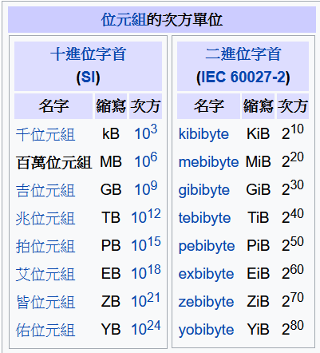{:height 258, :width 235} [wiki](https://zh.wikipedia.org/zh-tw/%E5%AD%97%E8%8A%82)
	- ## positional [進位制] number systems
		- ### binary [二進位]
			- ### 以2為基數 [base] 的數字系統，因其適合表示電路通電與斷電的狀態，所以廣泛運用於電腦系統與電路的設計。
			- ### 使用的數字表示符號 : {0, 1}
		- ### octal [八進位]
			- ### 以8為基數的，因為許多資料標準以8個位元為基準，所以8進位成用在許多的數據儲存與讀取中。
			- ### 使用的數字表示符號 : {0, 1, 2, 3, 4, 5, 6, 7}
		- ### decimal [十進位]
			- ### 基數為10的數字系統，為現今大多人與大多領域在使用的數字系統。
			- ### 使用的數字表示符號 : {0, 1, 2, 3, 4, 5, 6, 7, 8, 9}
		- ### hexadecimal [十六進位]
			- ### 以16為基數的數字系統，可以看成2個8位元所組成，所以非常適合用於檔案的傳輸與讀取，
			- ### 使用的數字表示符號: {0, 1, 2, 3, 4, 5, 6, 7, 8, 9, A, B, C, D, E, F}
	- ## 當數字以b進位制表示時，其的整數部分會以$$b^0$$開始計算每向左一位次方加一，而小數部分以$$b^{-1}$$開始，每向右一位次方減一。
		- ((635a86c2-78a1-42f9-bf86-1f4785dd2ee9))
			- ### <S is symbols, b is base>
			- ### before dot is integral part [整數部分], after dot is fractional part [小數部分]
			- ### EX: $$ (+224)_{10} \rightarrow (2 \times 10^2) + (2 \times 10^1) + (4 \times 10^0) $$
	- ## 計算以b進位制表示之k位元的最大儲存值:
		- ### 公式: $$N_{max} = b^k - 1$$
		- ### EX: 計算十進位五位數的最大表示值，$$b = 10，k=5，N_{max} = 10^5 - 1 = 99999$$
	- ## 進位制轉換
		- ### 十進位轉換成其它任意的進位制
			- ### 公式: $$(a.b)_{10} \rightarrow (ed.gh)_x$$
				- ### 整數部分轉換: $$a \xrightarrow{a \div x = c ... d} c \xrightarrow{c \div x = 0 ... e} 0$$
					- ### 將十進位的整數部分一直除以要轉換的進位制基數，每次將餘數取出，再用商數再重新上面的步驟，直到商數為零為止。
				- ### 小數部分轉換: $$b \xrightarrow{0.b \times x = g.f} f \xrightarrow{0.f \times x = h.0} 0$$
					- ### 將十進位的小數部分一直乘以要轉換的進位制基數，每次將整數部分取出，再將小數部分重複上述步驟，直到小數部分為零為止。
		- ### 將任意進位值轉換成十進位
			- ### 公式: $$(abcde.fg)_x \Rightarrow ((a \times x^4) + (b \times x^3) + (c \times x^2) + (d \times x^1) + (e \times x^0) + (f \times x^{-1}) + (g \times x^{-2}))_{10}$$
	- ## k位數的A進位制轉換成B進位制的最大位數
		- ### 公式: $$digits_{max} = k \times \left\lceil log A / log B \right\rceil$$
- # Chapter three - Data Storage
  id:: 635e7b7d-7ab0-4011-8323-bf2bcda85231
  collapsed:: true
	- ## Data type
		- ### types : number, text, audio, image and video
		- ### use Bit patterns in computer -> $$(0010011)_{2}$$
	- ## data store and retrieve [擷取]
		- ### integer
			- ((6382de02-4037-493e-b000-08e15bfc062e))
			- ### Signed integer [帶正負號整數]
				- ### 表示法 : $$(01100)_2$$ <他的最左邊的數字代表這這整個數字的正負值，正為0，負為1>
			- ### overflow<整數溢位> :
				- ### 因為數字計算超出使用位數的關係，使得到的結果與預期的不符。
				- ### unsigned integer
					- ### True : $$(0000)_2 + (0001)_2 = (0001)_2$$ <$$0+1 = 1$$>
					- ### False : $$(1111)_{2} + (0001)_{2} = 1(0000)_{2}$$ <$$15 + 1 = 0$$>
				- ### singed integer
					- ### Ture : $$(0000)_{2} + (0001)_{2} = (0001)_{2}$$ <$$0 + 1 = 1$$>
					- ### False : $$(0111)_{2} + (0011)_{2} = (1010)_{2}$$ <$$7 + 3 = -2$$>
			- ### store number in n-bits memory
				- ### 如果儲存的數值沒有存滿n-bits的記憶體，電腦將會在最左邊加入0直到存滿n-bits。
				- 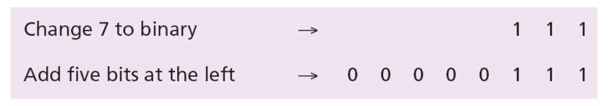
	- ## Two's complement [二補數]
		- ### One's complement [一補數]
			- ### 將每個位元的值翻轉，0轉成1，1轉成0。
			- ((6382e145-3397-40b6-9ac9-047290727768))
		- ### 二補數是運用數字二進位值的重新排序，使得新的排序0和-0合併，增加可用的空間。
			- ((6382e2fa-29a9-4f55-a1d9-b6d5ca57b780))
			- ((6382e251-c95e-43e8-b709-e4ad106068f0))
			- ### 計算方式
				- ### 轉成二補數 : 當數值本來就是正值時，直接就是二補數值；但當數值是負值時，將數值轉成正值並換成一補數，再加上1，就是此負值的二補數。
				- ### 二補數轉回正常格式 : 當二補數是正值時，一樣本身就是正常格式；當二補數是負值時，將數值直接轉換成正常格式，在將正常格式的數值轉呈負數即可。
				- 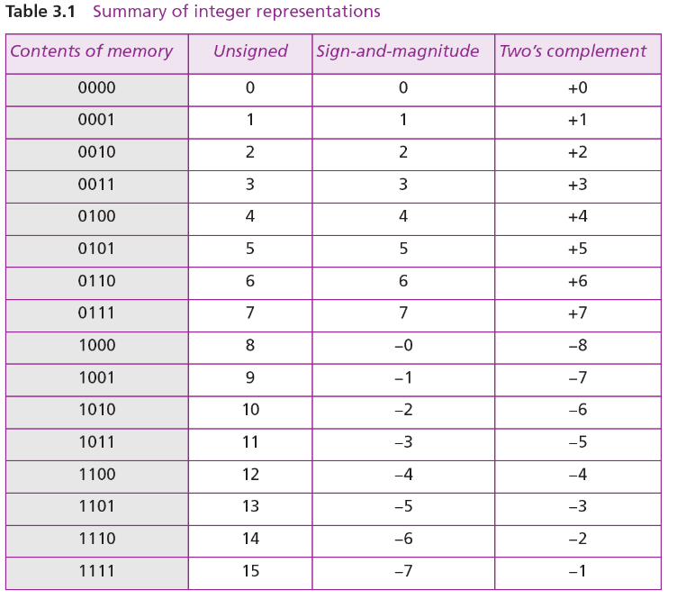
	- ## The Excess system
		- ### 格式
			- ((6382eec5-e57b-4b7b-92d3-7378bc476e4b))
			- ### Sign : 儲存數值的正負值 (0為正值，1為負值)
			- ### Shifter : 儲存數值的位移量
				- ((6382efcc-1e1c-4e38-aeba-1c2a3cc08c87))
			- ### Fixed-point number : 儲存數值經過簡化的值
		- ### 用處 : 儲存浮點數或超大的數值
			- ### 浮點樹儲存
				- ((6382eea4-e6f3-4ba1-9809-4693dd0b5768))
			- ### 超大值儲存
				- ((6382ee4c-03f0-4c47-b341-f2c2ddc954f9))
		- ### IEEE standards
			- ### 由 IEEE 制定的浮點數格式
			- ((6382f108-fb7c-4e9a-8067-cd5d90411b91))
				- ### S 為 Sign
				- ### Exponent 為 Shifter
				- ### Mantissa 為 Fixed-point number
			- ((6382f19c-f873-49f1-9e6c-f58d22c0f222))
			- ((6382ffe0-d155-458a-8bcf-b53de6ab4308))
- # Chapter four - Operations on data
  id:: 63818f14-5da7-4322-bc0b-8e10e5452589
  collapsed:: true
	- ## Logic operator
		- ### NOT : 唯一的單位元邏輯運算符，0轉1，1轉0。
		- ### AND : 當兩個位元均為1時，結果為1。
		- ### OR : 兩個位元中，只要有一個為1，結果就為1。
		- ### XOR : 兩個位元中，只能有一個是1，結果才為1。
		- ((638303a0-1dfb-4f45-8bfd-6f68ffa52640))
		- ### n-bits 的邏輯運算
			- ((638303d9-fcb6-4499-967d-a9ac6540bdd0))
	- ## Applications
		- ### 1. Complementing <補數運算> -> NOT
		- ### 2. Unsetting specific bits <重製特定位元為0> -> AND
			- ((638305bc-4417-472d-8d0d-018593bea70f))
		- ### 3. Setting specific bits <重製特定位元為1> -> OR
			- ((638305d7-9523-4996-83a0-1b028065bd5f))
		- ### 4. Flipping specific bits <翻轉特定位元> -> XOR
			- ((638305e3-3c52-413a-8862-318257af4e09))
	- ## Shift operation
		- ### Simple shift
			- ### 將位元向左或向右位移，將多出的值丟掉，並在另一邊補上0。
			- ((638306d5-b466-4463-874a-f33f91171927))
			- ((63830711-e1ee-429d-b99f-1a381a727317))
		- ### Circular shift
			- ### 將位元向左或向右位移，將多出的數值放回另一邊
			- ((63830777-fd9a-4c57-a0e1-8348f37a6b6e))
	- ## Arithmetic shift operation
		- ### 一樣讓位元左右位移，但如果是向右位移時，將最左位元得值保留；向左位移時，在最右邊加入0。
			- ((638309a5-6c9b-4116-8230-8c237a07e220))
			- ((63830a0a-f481-4b35-88d7-b35c5a066afd))
			- ((63830a14-0beb-4fb1-ae0b-40418f2804dd))
	- ## Arithmetic operation
		- ### 加法 : $$A + B = (A)_{2} + (B)_{2}$$
		- ### 減法 : $$A - B = (A)_{2} + (\bar{B} + 1)_{2}$$ <$$(\bar{B} + 1)_{2}$$ 為 Two's complement of B>
- # Chapter five - Computer Organization
  id:: 63818f45-2b7b-49c9-a1c6-9a6b77745ff7
  collapsed:: true
	- ## 電腦基本硬體
		- ((63830c55-f7ba-417e-a5aa-5459bcecc146))
	- ## Central processing unit <CPU> [中央處理單元]
		- ### 是電腦的大腦，許多指令與運算都需要經過它。
		- ((63830ce5-9405-4a13-ad48-fbda658a4788))
		- ### The Arithmetic logic unit <ALU> [算術邏輯單元]
			- ### 1. Logic operations <邏輯運算>
			- ### 2. Shift operations <位移運算>
			- ### 3. Arithmetic operations <算術運算>
		- ### Registers [寄存器]
			- ### 1. Data registers <數據寄存>
			- ### 2. Instruction registers [指令寄存]
			- ### 3. Program counter [程式計數器]
		- ### The control unit [控制單元]
	- ## Main Memory [主記憶體]
		- ### 暫存需要計算或運用的資料和程式碼等數據
		- ### Address : 每個記憶體位置都有自己的Address[地址]，使需要取用時，能更快速查找。
		- ((63830f1b-f95f-4b86-9942-7dfbd3c6a93c))
		- ((63830fbb-2234-4428-a350-9bc8ea3dbfd3))
		- ((63830fc5-da8f-4ffc-ba64-99c2757ea60c))
		- ### Random access memory <RAM> [隨機存取記憶體]
			- ### Static RAM <SRAM> [靜態隨機存取記憶體]
			- ### Dynamic RAM <DRAM> [動態隨機存取記憶體]
		- ### Read-only memory <ROM> [只讀記憶體]
			- ### programmable ROM <PROM> [可編程只讀記憶體]
			- ### erasable ROM <EROM> [可擦除只讀記憶體]
			- ### electrically erasable ROM <EEPROM> [電子擦除只讀記憶體]
		- ### Cache memory [快取記憶體]
			- ((6383118d-9741-4752-b0b5-b54f1f6d0697))
		- ((63831166-4b7f-414f-a698-59a083c7dd10))
- # Chapter six - Computer Networks and internet
  id:: 63818fae-c9aa-4087-8d57-15e2accb6671
  collapsed:: true
	- ## Network : is the interconnection [互聯] of a set of device capable of communication. <通過軟體與硬體的協助，將設備之間連接起來>
	  collapsed:: true
		- ### 功能: 將data從本地傳輸到其他地方。
		- ### hardware [硬體] : 由physical equipment [物理設備] 組成，利用signal [信號] 透過硬體將data從network的一個節點傳輸到其他節點。
		- ### software [軟體] : 建立在hardware之上，通過接收使用者指令，將data在hardware之間傳輸。
		- ### device : host <end system>[終端機], large computer [大型電腦], desktop [桌機], laptop [筆電], workstation [工作站], cellular phone [手機] ...
	- ## Network criteria [網路標準]
	  collapsed:: true
		- ### performance [性能] : 網路必須盡可能加快transit time [傳輸時間] 和response time [響應時間]。
		- ### reliability [可靠性] : 通過網路的故障頻率、故障恢復的速度與遇到不可抗力的catastrophe [災難]時的network’s robustness [抵禦能力] 來衡量。
		- ### network security [網路安全] : 網路中的data可能會遇到未經授權的訪問、修改和破壞。所以在遇到breaches [安全漏洞] 和 data losses [資料遺失] 時的維修與恢復等應變能力也是需要考量的。
	- ## Physical structures [物理結構]
		- ### 1. point-to-point : 點對點連線
		- ### 2. multipoint or switched : 多設備<節點>之間連線
		- 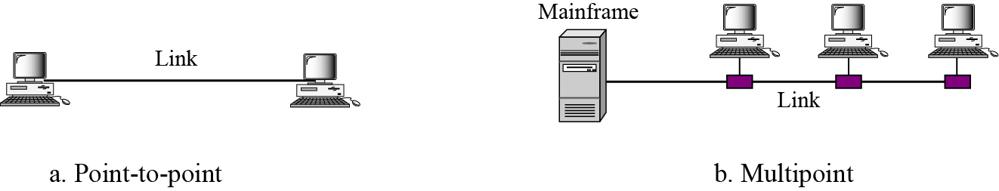{:height 121, :width 592}
		- ((6381e1a1-8f06-43af-8436-bfcb7d8ff65c))
		- ## Connecting device [連線設備]
			- ### Hub [集線器]
			- ### Switch [交換器]
			- ### Router [路由器]
			- ### Modem [數據機]
			- ### Repeater [中繼器]
			- ### Bridge [橋接器]
			- ### Gateway [閘道器]
	- ## Physical topologies [網路拓樸]
	  collapsed:: true
		- 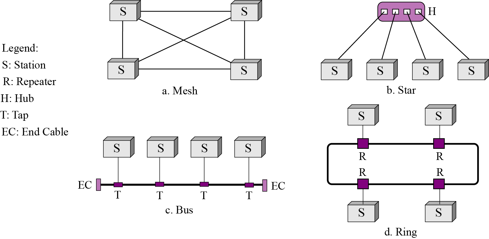{:height 373, :width 746}
	- ## LAN and WAN
	  collapsed:: true
		- ### LAN <Local Area Network> [區域網路、局域網] : 小範圍的網路，由多個網路設備連接，可以是一個公司的內網、一棟大樓的網路系統等。
		- ### WAN <Wide Area Network> [廣域網路] : 由網路設備或是局域網組成，範圍廣大，像大家最常使用的互聯網就是一個公共型的廣域網。
			- ### point-to-point WAN
			- ### switched WAN
		- ### MAN <Metropolitan Area Network> <都會網路>
		- 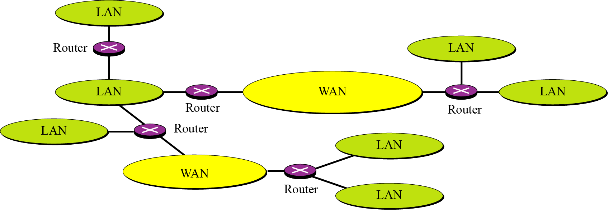
	- ## internet and Internet
	  collapsed:: true
		- ### 小寫i的internet和大寫I的Internet代表的意思並不一樣。
		- ### internet : 當兩個以上的網路或設備用任意協議連接起來，稱為internet。
			- ((6381ebf7-dbbc-4a5e-b37f-7ed5777227a9))
		- ### Internet : 是一個專有名詞，指現今各國、各機構和每個人在連接的網路(使用TCP/IP協議)。
			- ### Backbone network [骨幹網路]
			- ### ISP <Internet Service Providers> [網路服務提供商]
				- 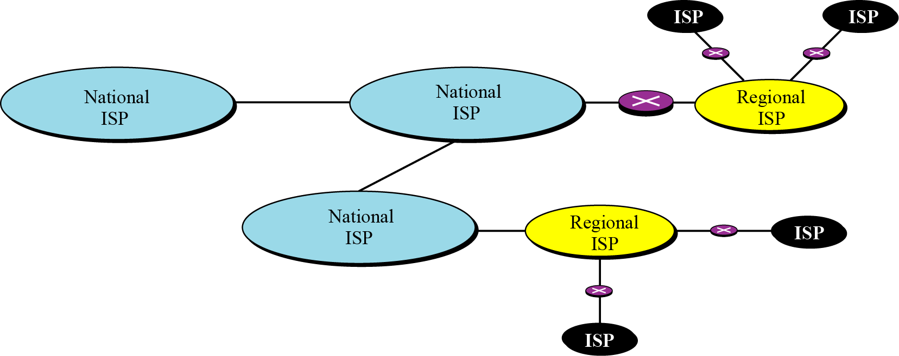{:height 269, :width 656}
			- ### 現今的Internet
				- ((6381ec20-307f-4e50-8947-005000679c58))
		- ((639dd744-610b-4d68-b064-7eec86ae0461))
	- ## Protocol Layer [協議層]
	  collapsed:: true
		- ### protocol [協議/協定] : 一套規則，將 sender [發送端]與 receiver [接收端]連接並進行通訊。
			- ((6381efaa-b7ea-4dc3-bb5e-17cc39a95b94))
		- ### TCP/IP <Transmission Control Protocol / Internet Protocol>
			- ((6381efd8-8511-4067-9547-4295e4a4d77b))
			- ((6381efeb-6e59-40aa-b8a0-9dbb6a32212e))
			- ((6381f00f-432a-48cd-999c-ea9a0cc4293c))
		- ## Application layer [應用層]
			- ### 是網路架構的最表層，也是使用者最常接觸的網路層，使用者從應用層輸入資料，再來通過其他的網路層的運作，最終將資料傳輸出去。
			- ### 範式
				- ### 傳統範式 : client-server [客戶端服務器]
					- 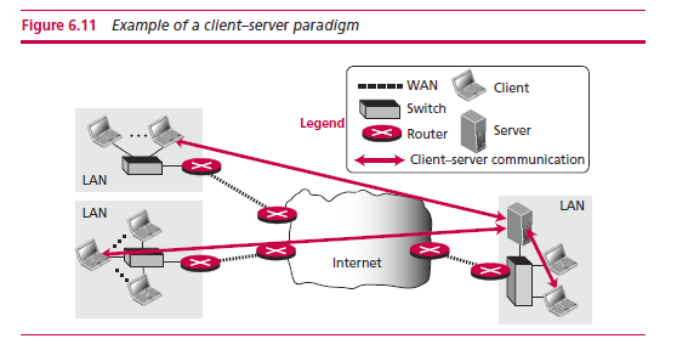
					- ### world wide web <www>
						- ### 簡稱為Web，是全球性的linked information [鏈結訊息] 儲存庫。
						- ### 可以使用browser [瀏覽器] 來與server [伺服器]連接。
						- ### 這些server分布於各個地方，稱之為web site [網站]。
						  collapsed:: true
							- 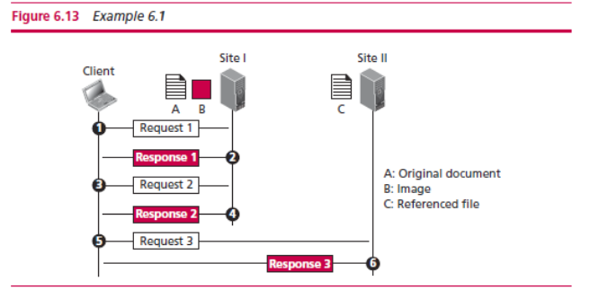
						- ### www使用了hypertext [超文本] 和 hypermedia [超媒體] 兩概念。
						  collapsed:: true
							- ### 在hypertext環境中，資訊儲存在一組document [文檔] 中，每個文檔互相通過鏈結的概念連結在一起
								- 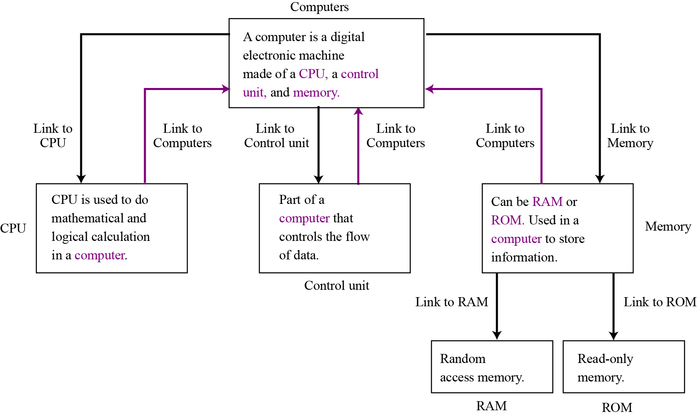
							- ### Hypertext Transfer Protocol <HTTP> [超文本傳輸協議]
								- ### www除了需要browser和server組成之外，還需要HTTP協議來進行通訊。
									- 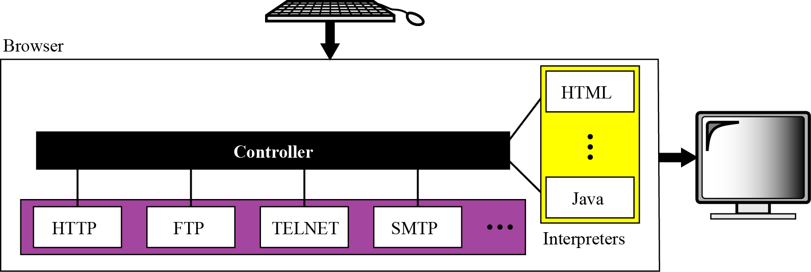
									- ### HTTP協議最主要是用來訪問www中的數據。
										- ### HTTP協議通過讓client [客戶端] 發送request [請求]給server，server接收到請求後，發送respones [回復] 將數據回傳客戶端來完成通訊。
										- 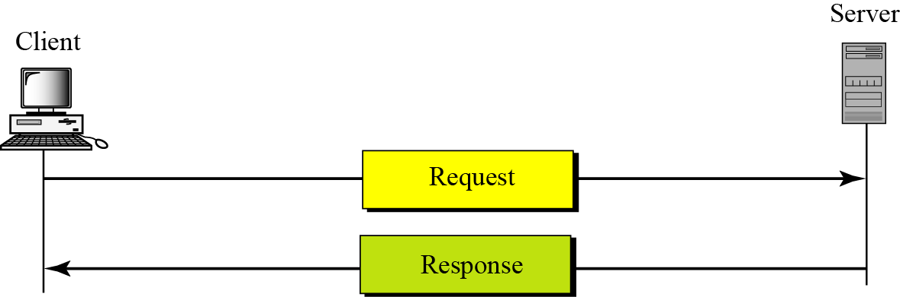{:height 166, :width 476}
									- ### uniform resource locator <URL> [統一資源定位符]
										- ### 客戶端想要訪問網路中的數據，就需要此數據在網路中的地址。
										- ### URL就是網路中，用來表示數據位置的格式。
										- ### URL由Method、Host、Port和Path組成
											- ### Method [方法] : 用來指定設備之間連線的協議 [protocol] 格式，不一定是HTTP，也可以是FTP或SSH等傳輸協議。
											- ### Host : 為伺服器在網路中的標籤<或是地址>，可以是伺服器的IP地址或者是domain [網域名稱] 。
											- ### Port [埠] : 又稱為端口，就如同港口裡的各個碼頭，由於系統中可能同一時間會有許多應用 [application] 需要進行通訊傳輸，所以需要port來指定確切的通訊位置。
												- ### port number，使用16進制來進行編碼，設定從0到65535，0到1023為系統保留的端口，1024到65535是開放讓任何人使用的端口。
											- ### Path : 用來指定在伺服器中，要訪問數據的地址。
										- 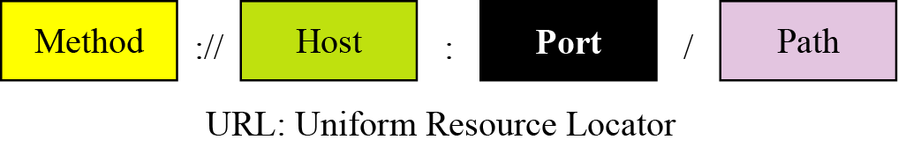
							- ### 數據在www中主要分為三類 : static [靜態] , dynamic [動態] and active。
							- ### Hypertext Markup Language <HTML> [超文本標記語言]
								- ### HTML是用在網路中的標記語言。
									- 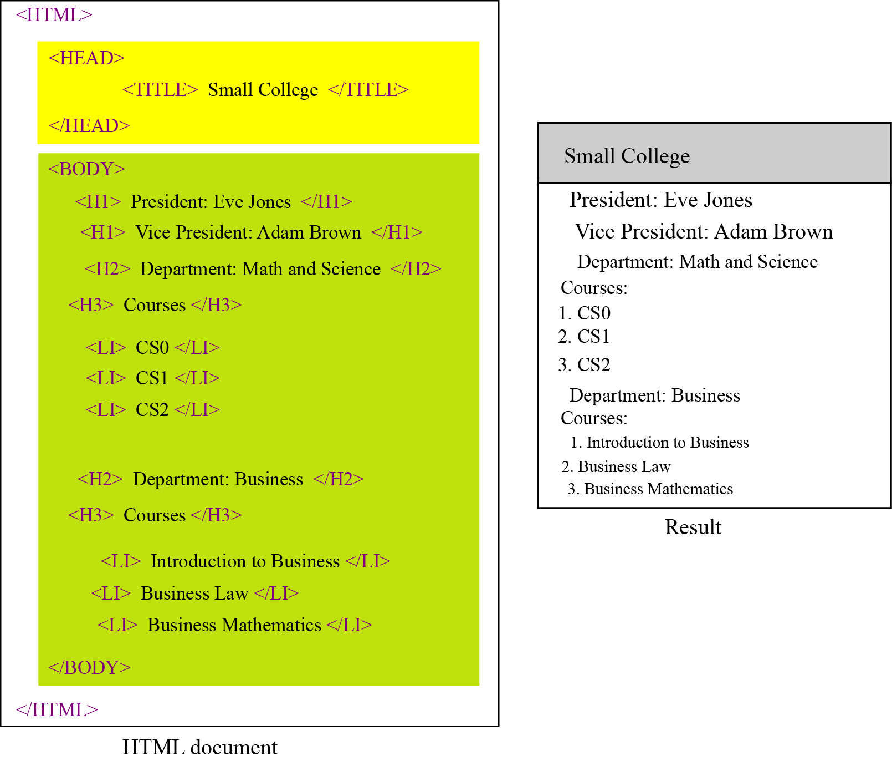
								- ### Extensible Markup Language <XML> [可擴展標記語言]
									- ### 由於HTML中的數據類型是已經定義好的，無法擴展，可擴展性就非常低，XML就是用來添補HTML的不足，XML的數據標籤可以讓使用者自定義要設什麼。
									- 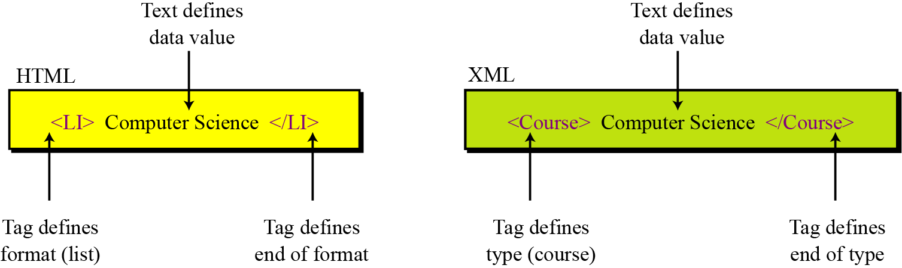
						- ### File Transfer Protocol <FTP> [檔案傳輸協議]
						  collapsed:: true
							- ### 網路中透過FTP來將數據文件從一台設備傳輸到另一台設備中
							- ((638b36c9-228e-4c0b-a0b6-1a0abecf5af3))
						- ### Electronic mail <email> [電子信箱]
						  collapsed:: true
							- ### email由於信件的發送時間是未知的，使得email很難兩台設備就組成，不然收件者的設備就必須一直處於運行的狀態，才能隨時響應寄件者的寄送請求。
							- ### email的組成主要需要兩個客戶端與兩個伺服器<有時也可能只有一個伺服器>，寄件者通過user interface [使用者介面] ，將信件寫完，傳輸到電子郵件伺服器中，電子郵件伺服器再將信件派送到收件者所使用的電子郵件伺服器<有時可能為同一台>，此時收件者就可以通過使用者介面查看寄給自己的電子郵件。
							- ((638b3962-576f-4e1a-8574-2c3c8980e7ba))
							- ### 常見的兩個email訪問協議
								- ### Post Office Protocol, version 3 <POP3> [郵局協議]
									- ### 用於客戶端遠端管理伺服器中的電子郵件
								- ### Internet Message Access Protocol <IMAP> [網際網路訊息存取協議]
									- ### 也是用來使本地客戶端遠端存取伺服器中的電子郵件
							- ### Email 地址格式
								- 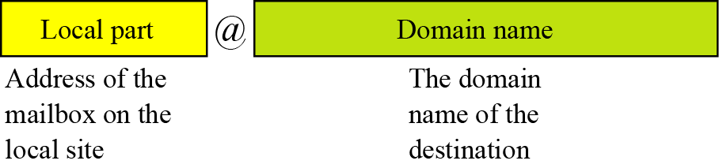
								- ### Local part : 指在電子郵件伺服器中的使用者名稱
								- ### Domain name : 在網際網路中，電子郵件伺服器的網域名稱
						- ### Domain name system <DNS> [域名系統]
						  collapsed:: true
							- ((639dd1d4-094c-4543-86fd-2a017b3b9112))
							- ### 藉由域名系統，將域名對應到相對的伺服器IP
							- ### 域名級別由後高到前低
								- 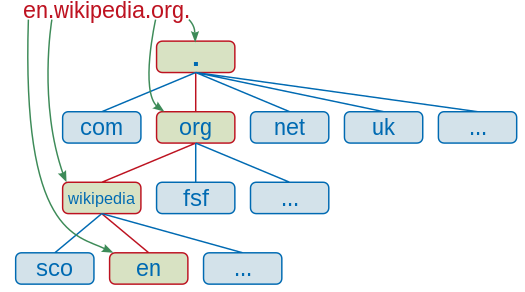
								  collapsed:: true
									- ### 取自維基 https://zh.wikipedia.org/zh-tw/%E5%9F%9F%E5%90%8D
								- ((639dd3c3-6df7-43e4-9b09-fb7174a04d50))
								- ### 例如 : https://mail.google.com
								  collapsed:: true
									- ### com為頂級域名
									- ### google為二級域名
									- ### mail為子域名<三級域名>
								- ((639dd3ac-4282-43c8-9cf7-e315416dafca))
								-
						- ### TELNET
						  collapsed:: true
							- 老師沒講，待自行補充
						- ### SSH
						  collapsed:: true
							- 老師沒講，待自行補充
				- ### 新式範式 : peer-to-peer [點對點]
					- ### 點對點通訊拋棄了server當中繼站，直接讓使用者與使用者之間建立通訊。
					- ### Decentralization [去中心化]。
					- ### 節點同時作為客戶端和伺服器端。
					- ### 沒有中心伺服器。
					- ### 沒有中心路由器
					- 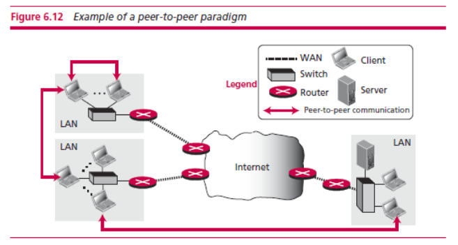
	- ## Transport Layer [傳輸層]
	  collapsed:: true
		- ### User Datagram Protocol <UDP> [使用者資料包協議]
			- ### UDP的特點就是發送端將數據傳輸給接收端後，將不會再保留和監控數據是否傳輸成功，藉此換取效率的提升，但也造成數據丟失將無法偵錯。
			- ((639dd941-c646-401b-9a7b-9ca70aaa3205))
		- ### Transmission Control Protocol <TCP> [傳輸控制協議]
			- ### TCP會在每次送數據後持續監控數據是否成功傳遞給接收端，直到接收端回傳收到數據的訊息，這樣保障了每筆傳輸的數據均可以傳送給接收端，但也因此使得TCP的效率無法與UDP相比。
			- ((639dd954-eba2-4432-8e4f-50f9c84e3b83))
	- ## Network Layer [網路層]
	  collapsed:: true
		- ### Internet Protocol version 4 <IPv4>
			- ### 以32個bits來儲存address，每八個bits為一組，形成四個10進位數，在系統中會以16進位表示。
			- ((639dd99d-4c90-4231-b4b1-a9ec8077f663))
			- ((639dda01-fbb4-434f-8520-3c104278f32a))
		- ### Internet Protocol version 6 <IPv6>
			- ### 由於IPv4的地址已經不夠用，所以又設計了IPv6，IPv6用128個bits儲存address，每16個bits為一組，8個16進位數表示
			- ((639dda98-49ab-4817-b183-dd0d4d3dd4c5))
			- ((639ddaaa-c453-47d7-92d0-b268b360cde8))
	- ## Data-link layer [資料鏈結層]
	  collapsed:: true
		- ### 將要傳輸的資料在各台設備間進行傳輸。
		- ((639ddb2d-59e2-4f1c-a03b-3aab65a21ce5))
	- ## Physical layer [物理層]
	  collapsed:: true
		- ### 硬體設備
- # Chapter seven - Algorithm
  id:: 639ddba2-9977-46cb-8abf-de6eb3bad9ae
  collapsed:: true
	- ## 核心思想 : a step-by-step method for solving a problem or doing a task.
	- ((639f07f2-e454-429a-b3e5-49b063665a24))
	- ## 正式定義 : an ordered set [有序集合]  of unambiguous [明確的] steps that product a result [產生結果] and terminates [終止] in a finite time [有限時間].
	- ## Three constructs
		- ### 1. Sequence <循序式>
		- ### 2. Decision <判斷式>
		- ### 3. Repetition <迴圈式>
		- ((63ad9a02-5b41-4fe5-bb78-432ac7ef7827))
	- ## 表示法
		- ### 1. Unified Modeling Language <UML> [統一塑模語言]
		  collapsed:: true
			- ((639f0f65-07fc-4745-b4d3-5c44765af75f))
		- ### 2. Pseudocode [虛擬碼]
		  collapsed:: true
			- ((639f0f93-24fd-4a1f-9c59-fc7d2ad90619))
	- ## basic algorithm (基本演算法)
		- ### 1. summation [加法]
			- ((63a7f403-84ff-44b3-b997-3ed612715239))
		- ### 2. product [乘法]
		  collapsed:: true
			- ((63a7f425-05ab-4ecf-a716-708c52739001))
		- ### 3. smallest and largest [找出極值]
		  collapsed:: true
			- ((63a7f441-589c-4b0a-aa59-13b8d4b07879))
			- ### 如果是找最大值，初值可以設定成無限小；要找最小值，初值則可以設成最大值
		- ### 4. sorting
			- ### selection sorts
			  collapsed:: true
				- ((63a7f48c-94aa-496c-8b4a-ac84d4675684))
			- ### bubble sorts
			  collapsed:: true
				- ((63a7f520-42c0-4951-80b8-d0cbac448537))
			- ### insertion sorts
			  collapsed:: true
				- ((63a7f535-f4b1-494b-842d-a81c365dfa2c))
			- ### ...etc
		- ### 5.search
			- ### sequential search
			  collapsed:: true
				- ((63a7f57a-9bef-467e-b4d9-688fac5c161e))
			- ### binary search
			  collapsed:: true
				- ((63a7f5a6-6358-438b-875c-c910f3abb569))
	- ## SubAlgorithm [子演算法]
	  collapsed:: true
		- ((63a7f73b-5ef9-44f7-8b38-bdf0870e0367))
		- ### <一個完整的演算法裡，可能會包含其他的演算法，這些在演算法中的演算法就稱為subalgorithm>
	- ## Recursion [遞迴]
	  collapsed:: true
		- ((63a7fb13-6939-47ee-abca-bd0662341dfa))
		- ### <在一個演算法中，可能處理的是同樣思路，但資料較小或較清晰，這時可以利用遞迴的思路來處理，例如費伯納西數列>
- # Chapter eight - Software Engineering
  id:: 63a7e3ec-0bb5-4bad-9d78-c5fafab17c89
  collapsed:: true
	- ## software lifecycle [軟體的生命週期]
		- ### <每個在市面上的軟體系統，都會有自己的生命周期，從開發到測試，再到運行維護，最後結束>
		- ((63a802b6-06bb-40d4-9022-c8cc20e70f91))
	- ## development process models [開發週期模型]
		- ### phases
			- ### 1. analysis [分析]
				-
			- ### 2. design [設計]
				-
			- ### 3. implementation [執行]
				-
			- ### 4. testing [測試]
				- ### glass-box testing [白箱測試]
				- ### black-box testing [黑箱測試]
		- ### model
			- ### waterfall model [瀑布模型]
				- ((63a80659-cdc2-49b3-bd4e-da79963cc670))
				- ### <是一個非常嚴謹的開發模型，每一次的開發過程，只能使用一個瀑布模型，直到這個瀑布模型結束，才能進行下一個開發程序>
			- ### incremental model [增進模型]
			  collapsed:: true
				- ((63a80719-cc22-4f87-b50a-11e7fb0a5fea))
				- ### <與瀑布模型最大的不同是，同一個時間可以進行多個開發模型>
			- ### agile model [敏捷模型]
			  collapsed:: true
				- ### 待補充
		- ### documentation [文檔]
			- ### user documentation [使用者文檔]
			- ### system documentation [系統文檔]
			- ### technical documentation [技術文檔]
- # Chapter nine - Operation System
  id:: 63b8f7e1-9072-4644-97bd-abc2f376e3c9
  collapsed:: true
	- ## basic structure [基礎結構] of Computer
		- ((63bea0b1-2bfc-4042-9c44-494deec35aad))
		- ### 電腦由硬體與軟體組成，而軟體又分為application program [應用程式] 與 operating system [作業系統]
			- ### operating system <controls the access to hardware by users>
				- ### 1. 作業系統是一個介面，介於硬體和user <programs or human>
				- ### 2. 作業系統是一個程式或程式集合
				- ### 3. 作業系統是一個通用管理器
				- ### 4. 作業系統目標 :
					- ### 1. efficient use of hardware
					- ### 2. easy use of resources
			- ### application program <solve users' problems>
		- ## bootstrap
			- ((63bec5d8-e2c9-4171-a192-c5475ed52a28))
			- ### starting computer
				- ### 1. CPU 讀取 bootstrap program <在ROM裡>
				- ### 2. 將operation system從Disk匯入到RAM中，CPU讀取operation system
		- ## components operating system
			- ((63bec6e1-5720-4021-89e9-89fc25a1fcc6))
		- ## state diagrams
			- ((63bec92a-b2f4-42b9-906a-4555345c05da))
			- ### 運作原理 : 啟動program後，從disk取出program source，將program變成job，再來放進memory中變成process，再來CPU從memory讀取process開始運行，當執行時限到時，CPU會先去執行其他process，反覆循環直到process執行結束，當process需要運行I/O時，會先釋放CPU去運行其他process。
			- ((63c00f98-c85e-4eaa-bfbb-8fa846c293d6))
		- ## process synchronization [進程同步]
			- ### 1. deadlock
				- ((63c00fb1-984a-4008-ae19-b1be6fe427cc))
				- ((63c00fc8-faf1-4a42-9d71-3d62a60209c4))
				- ### deadlock occurs when the operating system does not put resource restrictions on processes
				- ### 當罪業系統沒有對進程進行資源調配限制，將會造成進程衝突，形成死鎖
			- ### 2. starvation <the dining philosophers problem>
				- ((63c016a4-272a-49e7-8492-d8524e528b63))
				- ### 當作業系統對於進程的資源利用有嚴格限制時。將會造成資源濫用，產生starvation
			- ### starvation is the opposite of deadlock