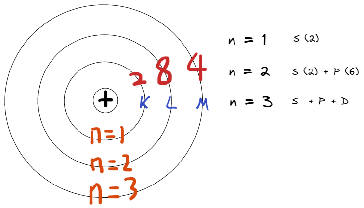

public:: true

- # 目錄
	- ((63f9a342-9115-4667-96f2-cedaa5c7d960))
- # Chapter One - Intro
  id:: 63f9a342-9115-4667-96f2-cedaa5c7d960
  collapsed:: true
	- ## Electron
		- ### 一個電子 = $$-1.6 \times 10^{-19}$$ C
		- ### 以 $$Si^{14}$$ 為例
			- 
		- ### 庫倫定律
			- ### 庫倫靜電力: $$F = \frac{k \ q_1 \ q_2}{r^2}$$
			- ### 電場: $$E = \frac{k \ q}{r^2}$$
			- ### 電位能: $$U = \frac{k \ q_1 \ q_2}{r}$$
			- ### 位能: $$V = \frac{k \ q}{r}$$
		- ### 電學公式
			- ### 電功率: $$P = I \times V = I^2 \times R = \frac{V^2}{R} = \frac{W}{t}$$
			- ### 電流: $$I = \frac{Q}{t}$$
			- ### 電壓: $$V = \frac{W}{Q}$$
	- ## Scientific and Engineering Notation
		- ### Scientific Notation [科學記號]: 將超過十位數(含)的位數，轉換成$$10^n$$的形式
			- ### 例: $$47000000 = 4.7 \times 10^7$$
		- ### Engineering Notation [工程記號]: 受到Engineering Metric Prefixes的影響，雖然一樣將超過十位數(含)的位數，轉換成$$10^n$$的形式，但$$n = 3, 6, 9, 12, 15$$
			- ### 例: $$47000000 = 47 \times 10^6$$
	- ## Si Fundamental Units
		- | Quantity | Unit | Symbol | 
		  | length | meter | m |
		  | mass | kilogram | kg |
		  | time | second | s |
		  | electric current | amperp | A |
		  | temperature | Kelvin | K |
		  | luminous intensity | candela | cd |
		  | amount of substance | mole | mol |
	- ## Some Important Electrical Units
		- | Quantity | Unit | Symbol |
		  | current | ampere | A |
		  | charge | coulomb | C |
		  | voltage | volt | V |
		  | resistance | ohm | $$\Omega$$ |
		  | power | watt | W |
	- ## Engineering Metric Prefixes
		- ### Large
			- | Symbol | Prefix | Power |
			  | P | peta | $$10^{15}$$ |
			  | T | tera | $$10^{12}$$ |
			  | G | giga | $$10^9$$ |
			  | M | mega | $$10^6$$ |
			  | k | kilo | $$10^3$$ |
		- ### Small
			- | Symbol | Prefix | Power |
			  | m | milli | $$10^{-3}$$ |
			  | $$\mu$$ | micro | $$10^{-6}$$ |
			  | n | nano | $$10^{-9}$$ |
			  | p | pico | $$10^{-12}$$ |
			  | f | femot | $$10^{-15}$$ |
	- ## Error, Accuracy and Precision
		- ### Error: Error is the difference between the true or best accepted value and the measured value
		- ### Accuracy [準確度] : 與目標的差距
		- ### Precision [精確度]: 所有測試值之間的差距
	- ## Significant Digits
		- ### 所有非零數字都是有效的
		- ### 非零數字間的零都是有效的
		- ### 前綴零始終無效
		- ### 對於需要小數點的數，後綴零（最後一個非零數字後的零）是有效的
		- ### 對於不需要小數點的數，後綴零可能有效也可能無效。需要根據額外的符號或者誤差訊息決定
		- ### <source by wiki>
	- ## Rounding numbers
		- ### round-to-even: 四捨六入，五取偶