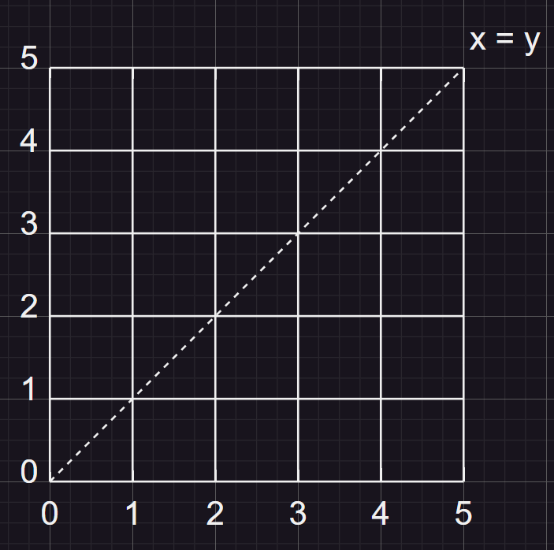
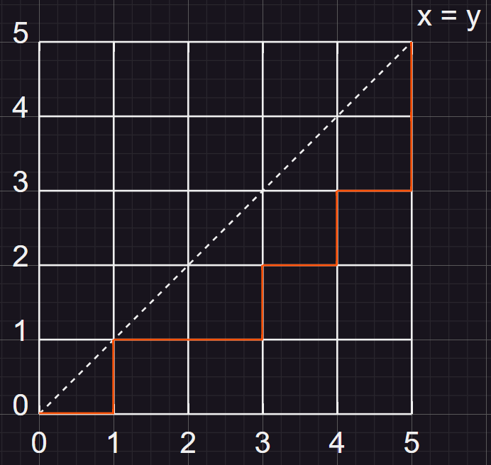
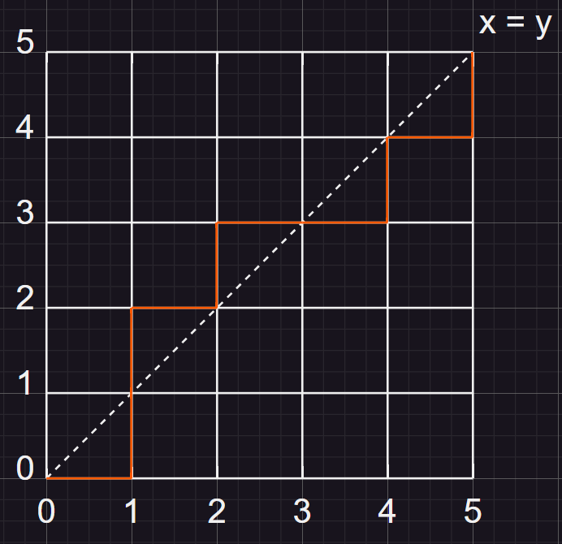
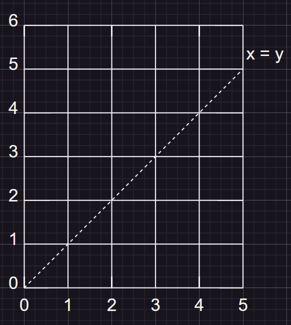
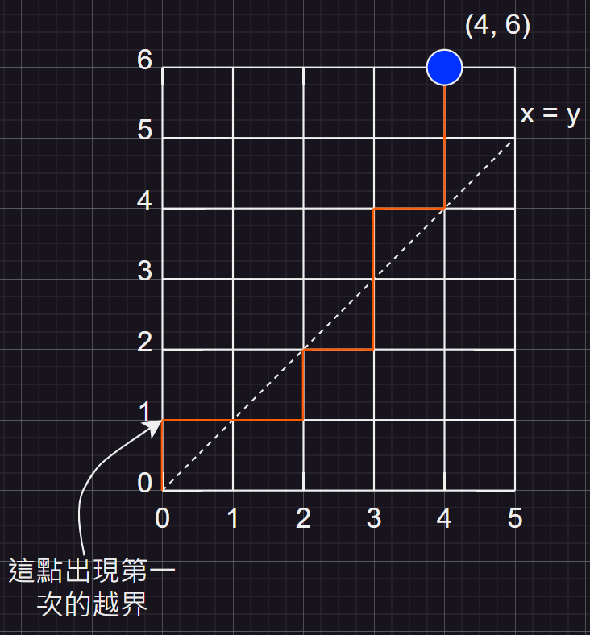
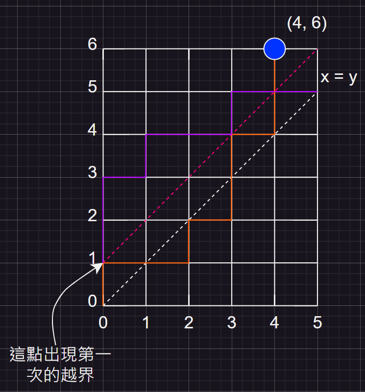
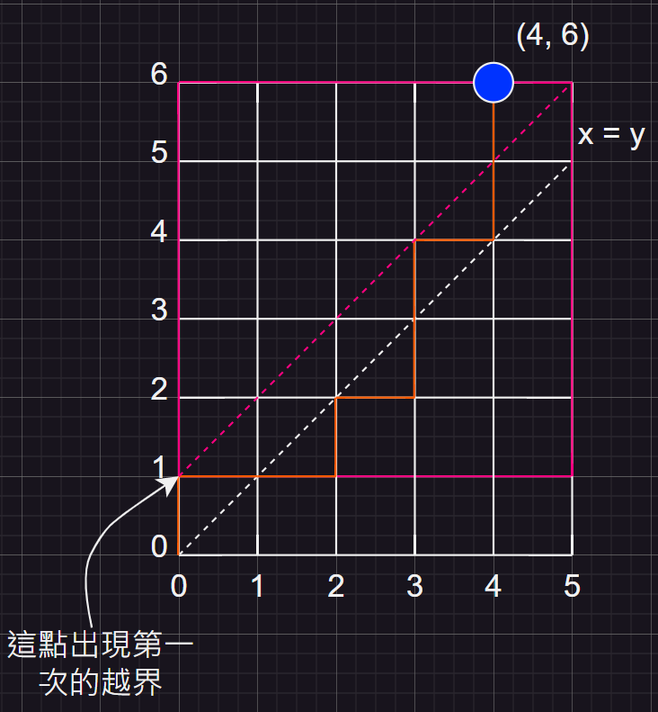
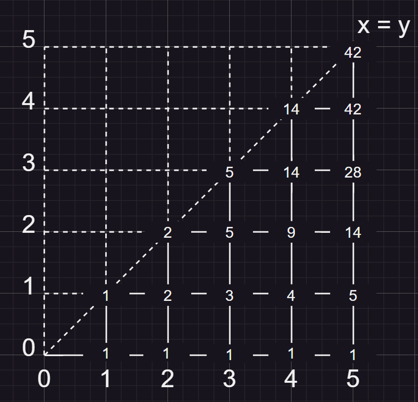

public:: true

- # 目錄
	- ((63f75058-9761-422d-ac49-e9eb9872de0d))
	- ((640cb39f-eda8-4edc-a798-01b1e58bde48))
- # Chapter One - Fundamental Principles of Counting
  id:: 63f75058-9761-422d-ac49-e9eb9872de0d
  collapsed:: true
	- ## <排列組合的原理>
	- ## The Rules of Sum and Product
		- ### the rule of sum:
			- 1. a task -> n ways
			  2. b task -> m ways
			  3. all tasks will n + m ways
			- ### <a and b tasks <ins>cannot be performed simultaneously</ins> >
		- ### the rule of product:
			- in a procedure
			  1. a stage -> n ways
			  2. b stage -> m ways
			  3. all stage will n * m ways
	- ## Permutations and Factorial
		- ### intro
		  id:: 64041c15-df70-4f70-af14-5113834d43a0
			- ### Ex: 有五個上面分別標示$$1 \sim 5$$的數字木牌，請問將這些木牌線性排列的組合有幾種。
				- ### 假設有五個區塊可以放置木牌<[A][B][C][D][E]>，那麼在區塊A就有5張木牌可以放上去，區塊B因為已經有一張在區塊A了，所以只剩4張可以放在裡面，依次下去即可得到算式$$5 \times 4 \times 3 \times 2 \times 1 = 120$$，得出結果為120種排列方式
				  id:: 64041e66-ce07-4ae1-bdeb-36361ed30e08
		- ### Factorial [階乘]
			- ### def: $$n!$$
				- $$0! = 1$$
				- $$n! = n \times (n-1) \times (n-2) \times (n-3) \times ... \times 3 \times 2 \times 1, \ for \ n \geq 1$$
			- ### [intro](((64041c15-df70-4f70-af14-5113834d43a0)))裡的算式也可表示為$$5! = 120$$
		- ### Permutations [排列]
			- ### def: $$P(n, r)$$
				- ### 表示n種物件中，取r個做排列的方式有幾種
				- $$P(n, r) = n \times (n-1) \times (n-2) \times ... \times (n-r+1) $$
				  $$= n \times (n-1) \times (n-2) \times ... \times (n-r+1) \times \frac{(n-r) \times (n-r-1) \times (n-r-2) \times ... \times 1}{(n-r) \times (n-r-1) \times (n-r-2) \times ... \times 1}$$
				  $$= \frac{n!}{(n-r)!}$$
			- ### 同一物件可能有多個時，進行排列
				- ### Ex: 有三種不同類型物件，類型分別為A、B和C，且數量分別為2個、2個和1個，請將算出這五個物件排列有幾種方式(同一類型物件在同一位置的排列只算一種)?
				- ### 如果直接計算$$P(5, 5)$$將會把類型A的兩個物件在同一位置的情況算成單獨計算(類型B也一樣有此問題)，所以在算完之後還需要在除以 $$2! \times 2!$$ 將這類情況去除
					- $$\frac{5!}{2! \times 2!} = 30$$
			- ### Combinational proof <組合證明>
				- ### if n and k are positive integers with $$n = 2k$$, then $$\frac{n!}{2^k}$$ is an integer
				- $$\frac{n!}{2! \times 2! \times ... \times 2!} = \frac{n!}{k^2}$$
	- ## Combinations [組合]
		- ### def: $$C(n, r)$$
			- ### 表示n個物件選出r個組合起來的方式有幾種(相同物件組合，但選出的順序不同也算同一種)
			- $$C(n, r) = \frac{P(n, r)}{r!} = \frac{n!}{r! \times (n - r)!} = \binom{n}{r} 
			   \ , \ 0 \leq r \leq n$$
		- ### def: $$\sum$$ <Sigma notation>
		- $$\sum_{i = m}^{m + n} a_i = a_m + a_{m+1} + a_{m+2} + ... + a_{m+n}$$
		- ### The Binomial Theorem <二項式定理>
			- ### 假設x和y為變數，並且n為正整數
			- id:: 640a0077-415a-4d89-a45c-efdbd321bc4a
			  $$(x + y)^n = \binom{n}{0}x^0y^n + \binom{n}{1}x^1y^{n-1} + \binom{n}{2}x^2y^{n-2} + ... + \binom{n}{n-1}x^{n-1}y^{1} + \binom{n}{n}x^ny^0$$
			  $$= \sum_{k=0}^{n} \binom{n}{k}x^k y^{n-k}$$
			- ### 所以如果我們計算出二項式 $$(x + y)^{a + b}$$ 的 $$x^ay^b$$ 項的係數，可以透過$$\binom{a+b}{a}$$ 或是 $$\binom{a+b}{b}$$ 得到答案
			- ### 在大於0的任意整數n中
				- ### 如果$$x = 1, y = 1$$，那麼$$(x + y)^n = \binom{n}{0} + \binom{n}{1} + ... + \binom{n}{n} = 2^n$$
				- ### 如果$$x = -1, y = 1$$，那麼$$(x + y)^n = \binom{n}{0} - \binom{n}{1} + \binom{n}{2} - ... + (-1)^n \binom{n}{n} = 0$$
		- ### The Multinomial Theorem <多項式定理>
			- ### 假設n 和 t 為正整數，在$$(x_1 + x_2 + x_3 + ... + x_t)^n$$中找出$$x^{n1}_1 \ x^{n2}_2 \ x^{n3}_3 \ ... \ x^{nt}_t$$項的係數
				- $$\binom{n}{n_1} \binom{n - n_1}{n_2} \binom{n - n_1 - n_2}{n_3} \ ... \ \binom{n - n_1 - n_2 - n_3 - \ ... \ - n_{t-1}}{n_t} = \frac{n!}{n_1! \ n_2! \ n_3! \ ... \ n_t!}$$
		- ### Combinations with repetion <計算單一物件可能重複的組合>
			- ### Ex: 有七個人到餐廳吃飯，餐廳有A、B、C和D餐可供選擇，請計算每個人都點一份餐點的情況下，總共有幾組選餐的組合?
				- ### 先用七個 X 表示七個人點的餐點
					- ### X X X X X X X
				- ### 再來因為總共有4個餐點可以選擇，所以我們用三個棍子來區隔選擇某餐點的人數
					- ### X X | X X | X X | X => A A B B C C D
					- ### X X X | X | X X | X => A A A B C C D
					- ### | | | X X X X X X X => D D D D D D D
				- ### 所以此題可以看作是七個 X 和三個棍子的組合
					- $$\frac{(3 + 7)!}{7! \ 3!} = \frac{10!}{7! \ 3!} = \binom{10}{7}$$
			- ### 由例題可知，如果我們想要計算 r 個物件分成 n 組類型的組合可以套入此式子
				- $$\frac{(n + r - 1)!}{r! \ (n - 1)!} = \binom{n + r - 1}{r} = C(n + r - 1, r)$$
		- ### The Catalan numbers
			- ### Ex: 有一個 $$5 \times 5$$ 的網格，請計算出從 $$(0, 0)$$ 走到 $$(5, 5)$$ 的所有組合，步型只能是往上移一格 $$(x, y + 1)$$或是往右移一格 $$(x + 1, y)$$ ，並且步型不能越過 $$x = y$$ 的線
			  {:height 268, :width 236}
				- ### 以下(A)圖是其中一個正確的走法，而(B)圖則是錯誤的走法
					- ### (A)
					  {:height 268, :width 236}
					- ### (B)
					  {:height 268, :width 236}
				- ### 假設我們以 U 為向上移動， R 為向右移動，用一組字串表示一組移動路徑，從左為起始
				- ### 那麼在隨機一格做斷點，左子路徑的 U 永遠不能超過 R ，否則就會越過 $$x =  y$$ 的界線
					- ### 正確路徑
						- ### RURRURURUU
					- ### 錯誤路徑
						- ### RUURURRURU
				- ### 並且我們知道從 $$(0, 0)$$ 走到 $$(5, 5)$$ 的所有路徑都是以五個 U 和五個 R 所組成的組合，所以所有的路徑和為$$\binom{10}{5} = 252$$
				- ### 有了所有路徑的總和，現在我們只要把錯誤的路徑去掉就是答案了，又找到所有錯誤的解，我們可以通過一個非常有趣的思考邏輯來計算出來，我們先將y軸增加一列
				- {:height 268, :width 236}
				- ### 再來我們觀察從 $$(0, 0)$$ 到 $$(4, 6)$$ 這一點上，我們可以發現如果在走錯一步之後 <也就是在第一次超過 $$x = y = 5$$ 的這條對角線後>
				- {:height 268, :width 236}
				- ### 我們可以看到後面的路徑如果以第一次錯誤的點到 $$x = y = 6$$ 這條對角線進行鏡像翻轉後，會發現終點變成到了 $$(5, 5)$$ 這點上，也就是題目要求的終點
				- {:height 268, :width 236}
				- ### 原因是因為在走錯一步之後的那點與 $$(6, 6)$$ 形成一個正方形，並且 $$(4, 6)$$ 以第一次錯誤的點到 $$x = y = 6$$ 的對角線做鏡像正好就是題目要找的終點 $$(5, 5)$$
				- {:height 268, :width 236}
				- ### 所以依照這樣的翻轉邏輯，我們可以發現所有從 $$(0, 0)$$ 到 $$(4, 6)$$ 的所有路徑經過此翻轉邏輯都會變成 從 $$(0, 0)$$ 到 $$(5, 5)$$ 的路徑，並且因為都是在出現一次的越界後才進行翻轉，所以可以保證所有計算到的路徑都是錯誤的路徑
				- ### 所以我們只要將從 $$(0, 0)$$ 到 $$(5, 5)$$ 的所有路徑減去從 $$(0, 0)$$ 到 $$(4, 6)$$ 的所有路徑，就可以得到答案了
				- $$\binom{10}{5} - \binom{10}{4} = 42$$
				- ### 通過利用動態規劃 $$(x, y) = (x - 1, y) + (x, y - 1)$$ 的解法也可以驗證此答案
				- {:height 268, :width 236}
	- ## Summary
		- id:: 6415c0ed-fe83-416b-8357-6ebe70eaf323
		  | 排列有順序關係 | 允許單一物件有多個 | 類型 | 公式 |
		  | --------------- | -------------------- | ---- | ----- |
		  | 有 | 不可 | permutation | $$P(n, r) = \frac{n!}{n!-r!} \ , 0 \leq r \leq n$$ |
		  | 有 | 可 | arrangement | $$n^r \ , \ n , r \geq 0$$ |
		  | 無 | 不可 | combination | $$C(n, r) = \frac{n!}{r! (n-r)!} \ , 0 \leq r \leq n$$ |
		  | 無 | 可 | combination with repetition | $$C(n + r - 1, r)$$ |
- # Chapter Two - Fundamentals of Logic
  id:: 640cb39f-eda8-4edc-a798-01b1e58bde48
  collapsed:: true
	- ## <數理邏輯的基礎>