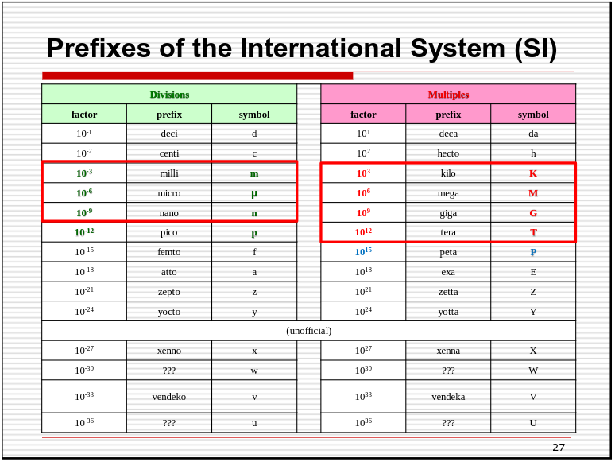
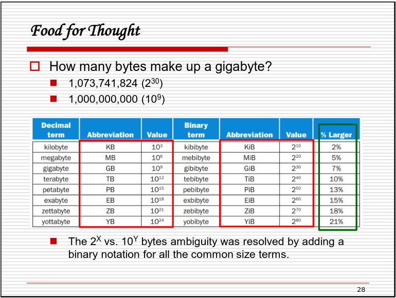

## CH1 intro
	- classes of computers
		- Personal computers
			- General purpose, variety of software
		- Server computers
			- network based
			- high capacity, performance, reliability
		- supercomputers
			- type for server
			- High-end scientific and engineering calculations
			- highest capability but represent a small fraction of the overall computer market
		- embedded computers
			- hidden as components of systems
			- stringent power/performance/cost const
	- the postPC era
		- personal mobile device (PMD)
			- battery operated
		- cloud computing
			- warehouse scale computers (WSC)
			- software as a service (SaaS)
			- Portion of software run on a PMD and Cloud
	- *understanding performance*
		- algorithm
			- determines numbers of operations executed
		- programming language, compiler, architecture
			- determine number of machine instructions executed per operation
		- processor and memory system
			- determine how fast instructions are executed
		- I/O system (including OS)
			- determines how fast I/O operations are executed
	- Prefixes of the International System (SI)
		- 
		- 
	- seven great ideas
		- Moore's law
		- abstraction
			- hide lower-level detail
			- instruction set architecture (ISA)
				- the hardware / software interface
			- application binary interface
				- the ISA plus system software interface
			- implementation
				- the detail underlying and interface
		- common case fast
		- parallelism
		- pipelining
		- prediction
		- hierarchy
		- dependability
	- component for computers
		- the big picture
			- input,
			- output
			- memory
				- volatile main memory
				- non-volatile secondary memory
			- Process (CPU)
				- datapath
					- performs operations on data
				- control
					- sequences datapath, memory, ...
				- cache memory
					- small fast SRAM memory for immediate access to data
		- Performance
			- Response Time
				- How long it takes to do a task
			- Throughput
				- total work done per unit time
			- Relative Performance
				- define: $$Performance = \frac{1}{Execution \ Time}$$
				- X is `n` time faster then Y
					- $$\frac{Performance_X}{Performance_Y} = \frac{Execution \ Time_Y}{Execution \ Time_X}$$
			- Measuring Execution Time
				- Elapsed time
					- Total response time, including all aspects
					- Determines system performance
				- CPU time
					- Time spent processing a given job
					- Comprises user CPU time and system CPU time
					- Different programs are affected differently by CPU and system performance
					- $$CPU \ Time = CPU \ Clock \ Cycles \times Clock \ Cycle \ Time = \frac{CPU \ Clock \ Cycles}{Clock \ Rate}$$
				- CPU clocking
					- Operation of digital hardware governed by a constant-rate clock
					- Component
						- clock period: duration of a clock cycle
							- e.g. $$250ps = 0.25ns = 250 \times 10^{-12}s$$
						- clock frequency (rate): cycles per second
							- e.g. $$4.0GHz = 4000MHz = 4.0 \times 10^9 Hz$$
			- Instruction Count and CPI (Cycles Per Instruction)
				- Instruction Count for a program
					- Determined by program, ISA and compiler
				- Average cycles per instruction
					- Determined by CPU hardware
					- if different instructions have different CPI
						- Average CPI affected by instruction mix
				- $$Clock \ Cycles = Instruction \ Count \times \ Cycles \ Per \ Instruction$$
				- $$CPU \ Time = Instruction \ Count \times CPI \times Clock \ Cycle \ Time = \frac{Instruction \ Count  \times CPI}{Clock \ Rate}$$
				- more detail
					- if different instruction classes take different numbers of cycles
						- $$Clock \ Cycles = \sum_{i=1}^{n}(CPI_i \times Instruction \ Count_i)$$
					- Weighted average CPI
						- $$CPI = \frac{Clocks \ Cycles}{Instruction \ Count} = \sum_{i=1}^{n}(CPI_i \times \frac{Instruction \ Count_i}{Instruction \ Count})$$
						- Relative frequency
							- $$\frac{Instruction \ Count_i}{Instruction \ Count}$$
			- ### The Big Picture
				- $$CPU \ Time = \frac{Instructions}{Program} \times \frac{Clock \ Cycles}{Instruction} \times \frac{Seconds}{Clock \ Cycle}$$
				- Performance depends on
					- Algorithm: affects IC, possibly CPI
					- Programming Language: affects IC, CPI
					- Compiler: affects IC, CPI
					- Instruction set architecture: affects IC, CPI, $$T_c$$
		- The Power Trends
			- In CMOS IC technology
				- $$Power \approx \frac{1}{2} \times Capacitive \ load \times Voltage^2 \times Frequency$$
			- COMS Transistor implementations
			- Reducing Power
				- suppose a new CPU has
					- 85 % of capacitive load of old CPU
					- 15 % voltage and 15 % frequency reduction
				- $$\frac{P_{new}}{P_{old}} = \frac{C_{old} \times 0.85 \times (V_{old}\times 0.85)^2 \times F_{old}}{C_{old} \times V_{old} \times F_{old}} = 0.85^4  = 0.25$$
	- Multiprocessors
		- Multicore microprocessors
			- more than one processor per chip
		- Requires explicitly parallel programming
			- Compare with instruction level parallelism
				- Hardware executes multiple instructions at once
				- Hidden from the programmer
			- Hard to do
				- Programming for performance
				- Load balancing
				- Optimizing communication and synchronization
	- SPEC CPU Benchmark
		- Programs used to measure performance
		- Standard Performance Evaluation Corp (SPEC)
	- Pitfall: Amdahl's Law
		- $$T_{improved} = \frac{T_{affected}}{improvement \ factor} + T_{unaffected}$$
	- Pitfall: MIPS as a Performance Metric
		- MIPS: MILLIONS OF INSTRUCTIONS PER SECOND
		- $$MIPS = \frac{Instruction count}{Execution \ time \times 10^6} = \frac{Instruction}{\frac{Instruction \ count \times CPI}{Clock \ rate} \times 10^6} = \frac{Clock \ rate}{CPI \times 10^6}$$
- ## Instruction Set
	-